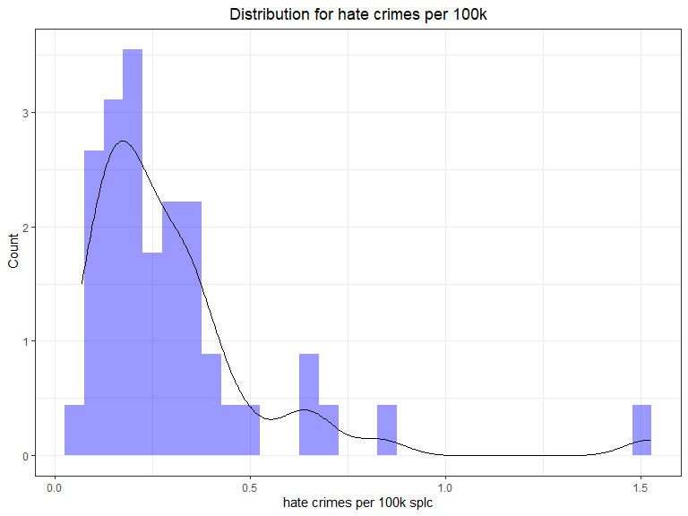
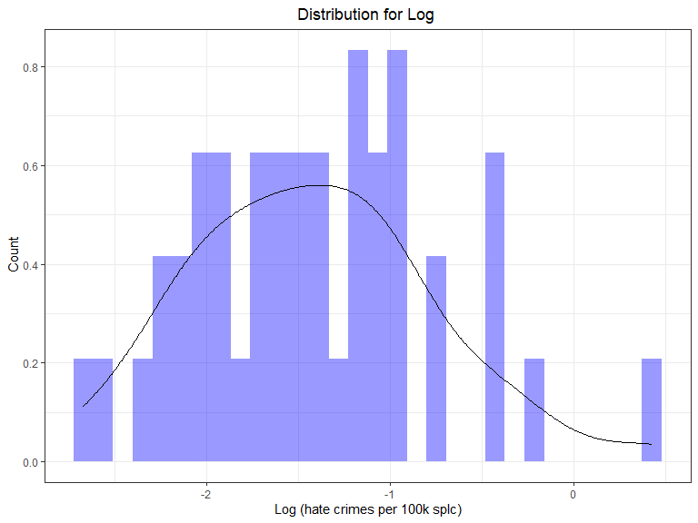

P8130 Final Project
================
Pengyuan Su (ps3195), Shuhong Xiang (sx2289), Yali Zhai (yz3959),
Zhixing Wu (zw2709)
12/6/2020

``` r
library(tidyverse)
library(modelr)
library(mgcv)
```

    ## Loading required package: nlme

    ## 
    ## Attaching package: 'nlme'

    ## The following object is masked from 'package:dplyr':
    ## 
    ##     collapse

    ## This is mgcv 1.8-33. For overview type 'help("mgcv-package")'.

# Introduction

# Abstract

# Data Analysis

``` r
hc_df = 
  read_csv(here::here("data/HateCrimes.csv")) %>% 
  janitor::clean_names() %>% 
  mutate(hate_crimes_per_100k_splc = as.numeric(hate_crimes_per_100k_splc)) %>% 
  drop_na()
```

    ## 
    ## -- Column specification --------------------------------------------------------
    ## cols(
    ##   state = col_character(),
    ##   unemployment = col_character(),
    ##   urbanization = col_character(),
    ##   median_household_income = col_double(),
    ##   perc_population_with_high_school_degree = col_double(),
    ##   perc_non_citizen = col_double(),
    ##   gini_index = col_double(),
    ##   perc_non_white = col_double(),
    ##   hate_crimes_per_100k_splc = col_character()
    ## )

``` r
head(hc_df)
```

    ## # A tibble: 6 x 9
    ##   state unemployment urbanization median_househol~ perc_population~
    ##   <chr> <chr>        <chr>                   <dbl>            <dbl>
    ## 1 Alab~ high         low                     42278            0.821
    ## 2 Alas~ high         low                     67629            0.914
    ## 3 Ariz~ high         high                    49254            0.842
    ## 4 Arka~ high         low                     44922            0.824
    ## 5 Cali~ high         high                    60487            0.806
    ## 6 Colo~ low          high                    60940            0.893
    ## # ... with 4 more variables: perc_non_citizen <dbl>, gini_index <dbl>,
    ## #   perc_non_white <dbl>, hate_crimes_per_100k_splc <dbl>

``` r
hc_df %>% 
  ggplot(aes(x = hate_crimes_per_100k_splc, y = ..density..)) +
  geom_histogram(fill = "blue", alpha = .4) +
  geom_density(aes( hate_crimes_per_100k_splc, y = ..density..)) +
  theme_bw() +
  labs(title = "Distribution for hate crimes per 100k",
       x = "hate crimes per 100k splc",
       y = " Count") +
  theme(plot.title = element_text(hjust = .5 ))
```

    ## `stat_bin()` using `bins = 30`. Pick better value with `binwidth`.



``` r
hc_df %>% 
  mutate(lg = log(hate_crimes_per_100k_splc)) %>% 
  ggplot(aes(x = lg, y = ..density..)) +
  geom_histogram(fill = "blue", alpha = .4) +
  geom_density(aes( lg, y = ..density..)) +
  theme_bw() +
  labs(title = "Distribution for Log ",
       x = "Log (hate crimes per 100k splc)",
       y = " Count") +
  theme(plot.title = element_text(hjust = .5 ))
```

    ## `stat_bin()` using `bins = 30`. Pick better value with `binwidth`.


