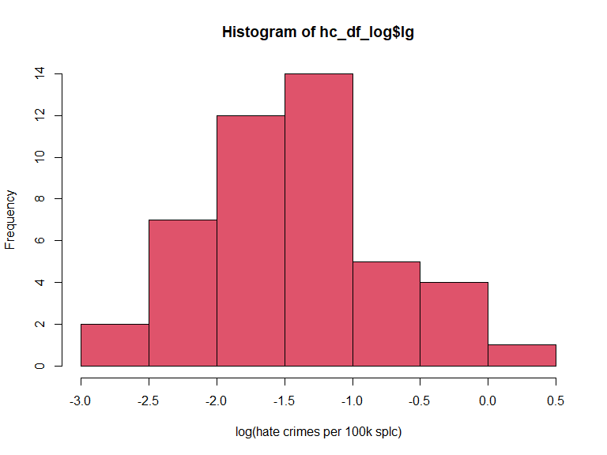
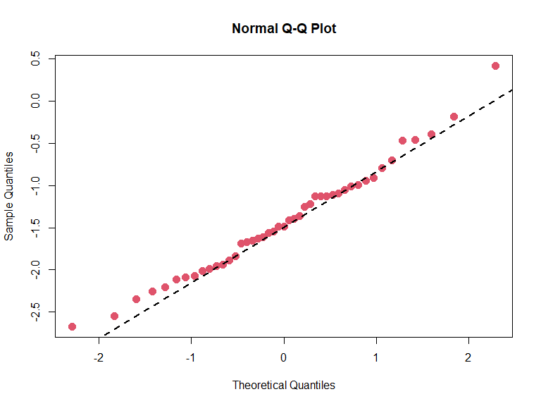

P8130 Final Project
================
Pengyuan Su (ps3195), Shuhong Xiang (sx2289), Yali Zhai (yz3959),
Zhixing Wu (zw2709)
12/6/2020

``` r
library(tidyverse)
library(modelr)
library(arsenal)
library(broom)
```

    ## 
    ## Attaching package: 'broom'

    ## The following object is masked from 'package:modelr':
    ## 
    ##     bootstrap

``` r
library(modelr)
library(patchwork)
library(mgcv)
```

    ## Loading required package: nlme

    ## 
    ## Attaching package: 'nlme'

    ## The following object is masked from 'package:dplyr':
    ## 
    ##     collapse

    ## This is mgcv 1.8-33. For overview type 'help("mgcv-package")'.

    ## 
    ## Attaching package: 'mgcv'

    ## The following object is masked from 'package:arsenal':
    ## 
    ##     negbin

``` r
library(faraway)
library(skimr)
```

# Abstract

# Introduction

Hate crime is a significant issue under the present circumstances. There
exist multiple variables related to hate crime. In this project, we
intend to find the relationships between the hate crime rate and the
eight variables. Among the eight variables, income status is about
unemployment level, medians of household income, and Gini index in the
dataset. Especially, the Gini index is a measure of the distribution of
income across a population developed by the Italian statistician Corrado
Gini in 1912. \[1\] In real life, the high-valued Gini index implies the
high levels of inequality in the whole society. Also, the high
unemployment rate will lower the medians of household income. People
without employment are more likely to participate in hate crime. \[2\]
Besides, the education level matters in income status. A higher level of
education status, like the high-school degree in this study, will lead
to an occupation with a higher salary, which can increase the medians of
household income and decrease unemployment.

Hate crime, according to website information
(<https://hatecrime.campaign.gov.uk/>), is regarded as the criminal
offence motivated by hostility or prejudice of others’ some
characteristics, including race, religion, sexual orientation,
transgender identity, disability. And our project mainly emphasizes on
the possible variables which might have close relation with the hate
crime rate.

The race consideration might become the most common cause of hate crime.
Based on the statistics provided
(<https://law.jrank.org/pages/12135/Race-Ethnicity-Hate-Crimes.html> ),
hate crimes resulting from race were about 49 percent in 2002 and 67
percent of victims attacked for racial problems were black Americans.

It is pointed out in this
article(<https://www.assignmentpoint.com/arts/social-science/the-role-of-urbanization-in-increasing-crime-in-urban-area-2.html>)
that the crime and urbanization seem to be correlated in terms of
sociological aspects since it have be linked between criminal cases and
the socio-economic development levels.

<https://safer-america.com/map-of-reported-hate-crimes-in-the-u-s-a/>
According to the Uniform Crime Reporting Program’s Hate Crime Statistics
Program, all the hate crimes reported to the FBI in 2017 of all the
states except Hawaii were shown, and the Pennsylvania had 1488 cases and
ranked the first. While in terms of the Hate Crimes per 100,000, the
District of Columbia had the largest figure of 27.81.

# Data Analysis

## Tidy:

`rate`: hate\_crimes\_per\_100k\_splc

`med_income`: median\_household\_income

`high_degree`: perc\_population\_with\_high\_school\_degree

`non_citizen`: perc\_non\_citizen

`non_white`: perc\_non\_white

``` r
hc_df = 
  read_csv(here::here("data/HateCrimes.csv")) %>% 
  janitor::clean_names() %>% 
  mutate(hate_crimes_per_100k_splc = as.numeric(hate_crimes_per_100k_splc)) %>% 
  drop_na() %>% 
  rename(., 
         rate = hate_crimes_per_100k_splc, 
         med_income = median_household_income, 
         high_degree = perc_population_with_high_school_degree, 
         non_citizen = perc_non_citizen, 
         non_white = perc_non_white)
```

    ## Parsed with column specification:
    ## cols(
    ##   state = col_character(),
    ##   unemployment = col_character(),
    ##   urbanization = col_character(),
    ##   median_household_income = col_double(),
    ##   perc_population_with_high_school_degree = col_double(),
    ##   perc_non_citizen = col_double(),
    ##   gini_index = col_double(),
    ##   perc_non_white = col_double(),
    ##   hate_crimes_per_100k_splc = col_character()
    ## )

``` r
head(hc_df)
```

    ## # A tibble: 6 x 9
    ##   state unemployment urbanization med_income high_degree non_citizen gini_index
    ##   <chr> <chr>        <chr>             <dbl>       <dbl>       <dbl>      <dbl>
    ## 1 Alab~ high         low               42278       0.821        0.02      0.472
    ## 2 Alas~ high         low               67629       0.914        0.04      0.422
    ## 3 Ariz~ high         high              49254       0.842        0.1       0.455
    ## 4 Arka~ high         low               44922       0.824        0.04      0.458
    ## 5 Cali~ high         high              60487       0.806        0.13      0.471
    ## 6 Colo~ low          high              60940       0.893        0.06      0.457
    ## # ... with 2 more variables: non_white <dbl>, rate <dbl>

Description by table?

``` r
my_controls <- tableby.control(
               total = T, # do you wanna show he overall col?
               test=F,  # No test p-values yet
               numeric.stats = c("meansd", "medianq1q3", "range", "Nmiss2"), # for the continuous var. (a.k.a numeric var.) 
               cat.stats = c("countpct", "Nmiss2"), # for categorical var., we select the count, percentage, and missing values.
               stats.labels = list(
               meansd = "Mean (SD)",
               medianq1q3 = "Median (Q1, Q3)",
               range = "Min - Max",
               Nmiss2 = "Missing",
               countpct = "N (%)"))


## or use skim()


#summary(tab1, title = "Descriptive statistics ", text = T,  digits = 1) %>%  knitr::kable()   
```

## Plot distribution of hate crimes rate

``` r
hc_df %>% 
  ggplot(aes(x = rate, y = ..density..)) +
  geom_histogram(fill = "blue", alpha = .4) +
  geom_density(aes( x = rate, y = ..density..)) +
  theme_bw() +
  labs(title = "Distribution for hate crimes per 100k",
       x = "hate crimes per 100k splc",
       y = " Count") +
  theme(plot.title = element_text(hjust = .5 ))
```

    ## `stat_bin()` using `bins = 30`. Pick better value with `binwidth`.


``` r
hc_df_log = 
  hc_df %>% 
  mutate(lg = log(rate))

hc_df_log%>% 
  ggplot(aes(x = lg, y = ..density..)) +
  geom_histogram(fill = "blue", alpha = .4) +
  geom_density(aes( lg, y = ..density..)) +
  theme_bw() +
  labs(title = "Distribution for Log ",
       x = "Log (hate crimes per 100k splc)",
       y = " Count") +
  theme(plot.title = element_text(hjust = .5 ))
```

    ## `stat_bin()` using `bins = 30`. Pick better value with `binwidth`.


``` r
# Histogram - notice the severe right skew
hist(hc_df_log$lg, xlab="log(hate crimes per 100k splc)", freq=T, col=2)
```



``` r
# Create a quantile-quantile plot (QQplot)
qqnorm(hc_df_log$lg, col=2, pch=19, cex=1.5)

# Add a straight line which passes through the first and third quartiles.
qqline(hc_df_log$lg, col = 1,lwd=2,lty=2)
```


Based on the QQ plot in terms of the log(hate crimes per 100k splc), the
points are nearly distributed along the straight line, so there is not
severe departure from the normality.

``` r
# Perform Shapiro-Wilk test
shapiro.test(hc_df_log$lg)
```

    ## 
    ##  Shapiro-Wilk normality test
    ## 
    ## data:  hc_df_log$lg
    ## W = 0.98308, p-value = 0.7453

H0: the log(hate crimes per 100k splc) is normally distributed H1: the
log(hate crimes per 100k splc) is not normally distributed

The W test statistic is 0.983 with p value of 0.7453.

Since the p value is greater than 0.05, so we fail to reject the null
and we could conclude that the log(hate crimes per 100k splc) seems to
be normally distributed under the significance level of 5%.

## Verify association

**income**

``` r
income = 
 lm(rate ~ med_income, data = hc_df)

summary(income)
```

    ## 
    ## Call:
    ## lm(formula = rate ~ med_income, data = hc_df)
    ## 
    ## Residuals:
    ##      Min       1Q   Median       3Q      Max 
    ## -0.32518 -0.12668 -0.04373  0.05772  1.09488 
    ## 
    ## Coefficients:
    ##               Estimate Std. Error t value Pr(>|t|)  
    ## (Intercept) -2.302e-01  2.247e-01  -1.024   0.3114  
    ## med_income   9.631e-06  4.012e-06   2.401   0.0208 *
    ## ---
    ## Signif. codes:  0 '***' 0.001 '**' 0.01 '*' 0.05 '.' 0.1 ' ' 1
    ## 
    ## Residual standard error: 0.239 on 43 degrees of freedom
    ## Multiple R-squared:  0.1182, Adjusted R-squared:  0.09768 
    ## F-statistic: 5.763 on 1 and 43 DF,  p-value: 0.02076

**high school degree**

``` r
degree = 
 lm(rate ~ high_degree, data = hc_df)

summary(degree)
```

    ## 
    ## Call:
    ## lm(formula = rate ~ high_degree, data = hc_df)
    ## 
    ## Residuals:
    ##      Min       1Q   Median       3Q      Max 
    ## -0.25882 -0.13075 -0.03059  0.07053  1.21096 
    ## 
    ## Coefficients:
    ##             Estimate Std. Error t value Pr(>|t|)  
    ## (Intercept)  -1.4520     0.9829  -1.477   0.1469  
    ## high_degree   2.0245     1.1334   1.786   0.0811 .
    ## ---
    ## Signif. codes:  0 '***' 0.001 '**' 0.01 '*' 0.05 '.' 0.1 ' ' 1
    ## 
    ## Residual standard error: 0.2455 on 43 degrees of freedom
    ## Multiple R-squared:  0.06907,    Adjusted R-squared:  0.04742 
    ## F-statistic: 3.191 on 1 and 43 DF,  p-value: 0.08112

**non citizen**

``` r
noncitizen = 
 lm(rate ~ non_citizen, data = hc_df)

summary(noncitizen)
```

    ## 
    ## Call:
    ## lm(formula = rate ~ non_citizen, data = hc_df)
    ## 
    ## Residuals:
    ##      Min       1Q   Median       3Q      Max 
    ## -0.33134 -0.13873 -0.04796  0.07165  1.11265 
    ## 
    ## Coefficients:
    ##             Estimate Std. Error t value Pr(>|t|)  
    ## (Intercept)  0.19390    0.07549   2.568   0.0138 *
    ## non_citizen  1.96134    1.19134   1.646   0.1070  
    ## ---
    ## Signif. codes:  0 '***' 0.001 '**' 0.01 '*' 0.05 '.' 0.1 ' ' 1
    ## 
    ## Residual standard error: 0.2468 on 43 degrees of freedom
    ## Multiple R-squared:  0.0593, Adjusted R-squared:  0.03742 
    ## F-statistic:  2.71 on 1 and 43 DF,  p-value: 0.107

**non white**

``` r
nonwhite = 
 lm(rate ~ non_white, data = hc_df)

summary(nonwhite)
```

    ## 
    ## Call:
    ## lm(formula = rate ~ non_white, data = hc_df)
    ## 
    ## Residuals:
    ##      Min       1Q   Median       3Q      Max 
    ## -0.24715 -0.14189 -0.09149  0.05348  1.16111 
    ## 
    ## Coefficients:
    ##             Estimate Std. Error t value Pr(>|t|)   
    ## (Intercept)  0.24271    0.08973   2.705  0.00975 **
    ## non_white    0.18807    0.25640   0.734  0.46723   
    ## ---
    ## Signif. codes:  0 '***' 0.001 '**' 0.01 '*' 0.05 '.' 0.1 ' ' 1
    ## 
    ## Residual standard error: 0.2529 on 43 degrees of freedom
    ## Multiple R-squared:  0.01236,    Adjusted R-squared:  -0.01061 
    ## F-statistic: 0.538 on 1 and 43 DF,  p-value: 0.4672

**gini index**

``` r
gini = 
 lm(rate ~ gini_index, data = hc_df)

summary(gini)
```

    ## 
    ## Call:
    ## lm(formula = rate ~ gini_index, data = hc_df)
    ## 
    ## Residuals:
    ##      Min       1Q   Median       3Q      Max 
    ## -0.28113 -0.14973 -0.04568  0.07525  0.87041 
    ## 
    ## Coefficients:
    ##             Estimate Std. Error t value Pr(>|t|)   
    ## (Intercept)  -1.7844     0.7742  -2.305  0.02608 * 
    ## gini_index    4.5794     1.6973   2.698  0.00992 **
    ## ---
    ## Signif. codes:  0 '***' 0.001 '**' 0.01 '*' 0.05 '.' 0.1 ' ' 1
    ## 
    ## Residual standard error: 0.2353 on 43 degrees of freedom
    ## Multiple R-squared:  0.1448, Adjusted R-squared:  0.1249 
    ## F-statistic:  7.28 on 1 and 43 DF,  p-value: 0.009924

## MLR

``` r
#mult.fit = lm(rate ~ ., data = hc_df)
#step(mult.fit, direction='backward')

#Error in step(mult.fit, direction = "backward") : 
  #AIC is -infinity for this model, so 'step' cannot proceed
```

## Correlation

``` r
modified_df = 
  hc_df %>% 
  select(-state) %>% 
  mutate(
    unemployment = as.factor(unemployment),
    urbanization = as.factor(urbanization)
  )

modified_df %>% 
   mutate(
    unemployment = as.numeric(unemployment),
    urbanization = as.numeric(urbanization)
  ) %>% cor() %>% round(., 2)
```

    ##              unemployment urbanization med_income high_degree non_citizen
    ## unemployment         1.00         0.24       0.25        0.45       -0.24
    ## urbanization         0.24         1.00      -0.26        0.16       -0.68
    ## med_income           0.25        -0.26       1.00        0.65        0.30
    ## high_degree          0.45         0.16       0.65        1.00       -0.26
    ## non_citizen         -0.24        -0.68       0.30       -0.26        1.00
    ## gini_index          -0.41        -0.43      -0.13       -0.54        0.48
    ## non_white           -0.43        -0.51       0.04       -0.50        0.75
    ## rate                 0.02        -0.21       0.34        0.26        0.24
    ##              gini_index non_white  rate
    ## unemployment      -0.41     -0.43  0.02
    ## urbanization      -0.43     -0.51 -0.21
    ## med_income        -0.13      0.04  0.34
    ## high_degree       -0.54     -0.50  0.26
    ## non_citizen        0.48      0.75  0.24
    ## gini_index         1.00      0.55  0.38
    ## non_white          0.55      1.00  0.11
    ## rate               0.38      0.11  1.00

## regression of all numeric variables

``` r
reg_all = lm(rate ~ med_income + high_degree + non_citizen + gini_index + non_white, data = modified_df)
 summary(reg_all)
```

    ## 
    ## Call:
    ## lm(formula = rate ~ med_income + high_degree + non_citizen + 
    ##     gini_index + non_white, data = modified_df)
    ## 
    ## Residuals:
    ##      Min       1Q   Median       3Q      Max 
    ## -0.36737 -0.10005 -0.01877  0.09497  0.52855 
    ## 
    ## Coefficients:
    ##               Estimate Std. Error t value Pr(>|t|)    
    ## (Intercept) -8.170e+00  1.841e+00  -4.437 7.25e-05 ***
    ## med_income  -1.589e-06  5.773e-06  -0.275  0.78461    
    ## high_degree  5.399e+00  1.788e+00   3.020  0.00444 ** 
    ## non_citizen  9.374e-01  1.643e+00   0.571  0.57154    
    ## gini_index   8.417e+00  1.873e+00   4.495 6.08e-05 ***
    ## non_white   -1.723e-02  3.485e-01  -0.049  0.96082    
    ## ---
    ## Signif. codes:  0 '***' 0.001 '**' 0.01 '*' 0.05 '.' 0.1 ' ' 1
    ## 
    ## Residual standard error: 0.1967 on 39 degrees of freedom
    ## Multiple R-squared:  0.458,  Adjusted R-squared:  0.3885 
    ## F-statistic: 6.592 on 5 and 39 DF,  p-value: 0.0001558

## stepwise

``` r
hc_df$unemployment <-ifelse(hc_df$unemployment=="high",1,ifelse(hc_df$unemployment=="low", 0, NA))

hc_df$urbanization <-ifelse(hc_df$urbanization=="high",1,ifelse(hc_df$urbanization=="low", 0, NA))

hc_df = 
  hc_df %>% 
  select(-state)  

model =  
  lm(rate ~ ., data = hc_df) 

 step(model, direction = 'backward')
```

    ## Start:  AIC=-137.03
    ## rate ~ unemployment + urbanization + med_income + high_degree + 
    ##     non_citizen + gini_index + non_white
    ## 
    ##                Df Sum of Sq    RSS     AIC
    ## - non_white     1   0.00001 1.5008 -139.03
    ## - unemployment  1   0.00135 1.5021 -138.99
    ## - med_income    1   0.00258 1.5034 -138.95
    ## - urbanization  1   0.00618 1.5070 -138.85
    ## - non_citizen   1   0.01750 1.5183 -138.51
    ## <none>                      1.5008 -137.03
    ## - high_degree   1   0.34889 1.8497 -129.62
    ## - gini_index    1   0.77465 2.2754 -120.30
    ## 
    ## Step:  AIC=-139.03
    ## rate ~ unemployment + urbanization + med_income + high_degree + 
    ##     non_citizen + gini_index
    ## 
    ##                Df Sum of Sq    RSS     AIC
    ## - unemployment  1   0.00148 1.5023 -140.99
    ## - med_income    1   0.00269 1.5035 -140.95
    ## - urbanization  1   0.00617 1.5070 -140.85
    ## - non_citizen   1   0.02422 1.5250 -140.31
    ## <none>                      1.5008 -139.03
    ## - high_degree   1   0.38759 1.8884 -130.69
    ## - gini_index    1   0.77888 2.2797 -122.22
    ## 
    ## Step:  AIC=-140.99
    ## rate ~ urbanization + med_income + high_degree + non_citizen + 
    ##     gini_index
    ## 
    ##                Df Sum of Sq    RSS     AIC
    ## - med_income    1   0.00243 1.5047 -142.91
    ## - urbanization  1   0.00693 1.5092 -142.78
    ## - non_citizen   1   0.02401 1.5263 -142.27
    ## <none>                      1.5023 -140.99
    ## - high_degree   1   0.40517 1.9074 -132.24
    ## - gini_index    1   0.78876 2.2910 -124.00
    ## 
    ## Step:  AIC=-142.91
    ## rate ~ urbanization + high_degree + non_citizen + gini_index
    ## 
    ##                Df Sum of Sq    RSS     AIC
    ## - urbanization  1   0.00762 1.5123 -144.69
    ## - non_citizen   1   0.02232 1.5270 -144.25
    ## <none>                      1.5047 -142.91
    ## - gini_index    1   0.78737 2.2921 -125.97
    ## - high_degree   1   0.86254 2.3672 -124.52
    ## 
    ## Step:  AIC=-144.69
    ## rate ~ high_degree + non_citizen + gini_index
    ## 
    ##               Df Sum of Sq    RSS     AIC
    ## - non_citizen  1   0.01471 1.5270 -146.25
    ## <none>                     1.5123 -144.69
    ## - gini_index   1   0.78804 2.3004 -127.81
    ## - high_degree  1   0.85561 2.3679 -126.51
    ## 
    ## Step:  AIC=-146.25
    ## rate ~ high_degree + gini_index
    ## 
    ##               Df Sum of Sq    RSS     AIC
    ## <none>                     1.5270 -146.25
    ## - high_degree  1   0.85432 2.3813 -128.25
    ## - gini_index   1   1.06513 2.5922 -124.44

    ## 
    ## Call:
    ## lm(formula = rate ~ high_degree + gini_index, data = hc_df)
    ## 
    ## Coefficients:
    ## (Intercept)  high_degree   gini_index  
    ##      -8.103        5.059        8.825

## Forward

``` r
# step1
fit1 <- lm(rate ~ unemployment, data = modified_df)
tidy(fit1)
```

    ## # A tibble: 2 x 5
    ##   term            estimate std.error statistic    p.value
    ##   <chr>              <dbl>     <dbl>     <dbl>      <dbl>
    ## 1 (Intercept)      0.298      0.0531     5.62  0.00000128
    ## 2 unemploymentlow  0.00825    0.0759     0.109 0.914

``` r
fit2 <- lm(rate ~ urbanization, data = modified_df)
tidy(fit2)
```

    ## # A tibble: 2 x 5
    ##   term            estimate std.error statistic      p.value
    ##   <chr>              <dbl>     <dbl>     <dbl>        <dbl>
    ## 1 (Intercept)        0.352    0.0508      6.93 0.0000000161
    ## 2 urbanizationlow   -0.106    0.0743     -1.43 0.161

``` r
fit3 <- lm(rate ~ med_income, data = modified_df)
tidy(fit3)
```

    ## # A tibble: 2 x 5
    ##   term           estimate  std.error statistic p.value
    ##   <chr>             <dbl>      <dbl>     <dbl>   <dbl>
    ## 1 (Intercept) -0.230      0.225          -1.02  0.311 
    ## 2 med_income   0.00000963 0.00000401      2.40  0.0208

``` r
fit4 <- lm(rate ~ high_degree, data = modified_df)
tidy(fit4)
```

    ## # A tibble: 2 x 5
    ##   term        estimate std.error statistic p.value
    ##   <chr>          <dbl>     <dbl>     <dbl>   <dbl>
    ## 1 (Intercept)    -1.45     0.983     -1.48  0.147 
    ## 2 high_degree     2.02     1.13       1.79  0.0811

``` r
fit5 <- lm(rate ~ non_citizen, data = modified_df)
tidy(fit5)
```

    ## # A tibble: 2 x 5
    ##   term        estimate std.error statistic p.value
    ##   <chr>          <dbl>     <dbl>     <dbl>   <dbl>
    ## 1 (Intercept)    0.194    0.0755      2.57  0.0138
    ## 2 non_citizen    1.96     1.19        1.65  0.107

``` r
fit6 <- lm(rate ~ gini_index, data = modified_df)
tidy(fit6)
```

    ## # A tibble: 2 x 5
    ##   term        estimate std.error statistic p.value
    ##   <chr>          <dbl>     <dbl>     <dbl>   <dbl>
    ## 1 (Intercept)    -1.78     0.774     -2.30 0.0261 
    ## 2 gini_index      4.58     1.70       2.70 0.00992

``` r
fit7 <- lm(rate ~ non_white, data = modified_df)
tidy(fit7)
```

    ## # A tibble: 2 x 5
    ##   term        estimate std.error statistic p.value
    ##   <chr>          <dbl>     <dbl>     <dbl>   <dbl>
    ## 1 (Intercept)    0.243    0.0897     2.70  0.00975
    ## 2 non_white      0.188    0.256      0.734 0.467

``` r
forward1 = lm(rate ~ gini_index, data = modified_df)

# step 2
fit1 <- update(forward1, . ~ . +unemployment)
tidy(fit1)
```

    ## # A tibble: 3 x 5
    ##   term            estimate std.error statistic p.value
    ##   <chr>              <dbl>     <dbl>     <dbl>   <dbl>
    ## 1 (Intercept)       -2.30     0.856      -2.68 0.0103 
    ## 2 gini_index         5.60     1.84        3.04 0.00408
    ## 3 unemploymentlow    0.103    0.0762      1.35 0.184

``` r
fit2 <- update(forward1, . ~ . +urbanization)
tidy(fit2)
```

    ## # A tibble: 3 x 5
    ##   term            estimate std.error statistic p.value
    ##   <chr>              <dbl>     <dbl>     <dbl>   <dbl>
    ## 1 (Intercept)      -1.63      0.882     -1.85   0.0719
    ## 2 gini_index        4.27      1.90       2.25   0.0299
    ## 3 urbanizationlow  -0.0299    0.0787    -0.380  0.706

``` r
fit3 <- update(forward1, . ~ . +med_income)
tidy(fit3)
```

    ## # A tibble: 3 x 5
    ##   term          estimate  std.error statistic p.value
    ##   <chr>            <dbl>      <dbl>     <dbl>   <dbl>
    ## 1 (Intercept) -2.69      0.766          -3.51 0.00109
    ## 2 gini_index   5.20      1.56            3.32 0.00184
    ## 3 med_income   0.0000112 0.00000364      3.07 0.00369

``` r
fit4 <- update(forward1, . ~ . +high_degree)
tidy(fit4)
```

    ## # A tibble: 3 x 5
    ##   term        estimate std.error statistic    p.value
    ##   <chr>          <dbl>     <dbl>     <dbl>      <dbl>
    ## 1 (Intercept)    -8.10      1.45     -5.60 0.00000148
    ## 2 gini_index      8.82      1.63      5.41 0.00000276
    ## 3 high_degree     5.06      1.04      4.85 0.0000174

``` r
fit5 <- update(forward1, . ~ . +non_citizen)
tidy(fit5)
```

    ## # A tibble: 3 x 5
    ##   term        estimate std.error statistic p.value
    ##   <chr>          <dbl>     <dbl>     <dbl>   <dbl>
    ## 1 (Intercept)   -1.61      0.858    -1.88   0.0673
    ## 2 gini_index     4.12      1.95      2.11   0.0407
    ## 3 non_citizen    0.637     1.31      0.488  0.628

``` r
fit6 <- update(forward1, . ~ . +non_white)
tidy(fit6)
```

    ## # A tibble: 3 x 5
    ##   term        estimate std.error statistic p.value
    ##   <chr>          <dbl>     <dbl>     <dbl>   <dbl>
    ## 1 (Intercept)   -2.13      0.883    -2.41  0.0203 
    ## 2 gini_index     5.50      2.04      2.70  0.00997
    ## 3 non_white     -0.236     0.286    -0.824 0.415

``` r
forward2 = update(forward1, . ~ . +high_degree)

#step 3
fit1 <- update(forward2, . ~ . +unemployment)
tidy(fit1)
```

    ## # A tibble: 4 x 5
    ##   term            estimate std.error statistic    p.value
    ##   <chr>              <dbl>     <dbl>     <dbl>      <dbl>
    ## 1 (Intercept)      -8.09      1.47      -5.52  0.00000211
    ## 2 gini_index        8.90      1.69       5.26  0.00000483
    ## 3 high_degree       4.99      1.11       4.51  0.0000536 
    ## 4 unemploymentlow   0.0126    0.0661     0.191 0.849

``` r
fit2 <- update(forward2, . ~ . +urbanization)
tidy(fit2)
```

    ## # A tibble: 4 x 5
    ##   term            estimate std.error statistic    p.value
    ##   <chr>              <dbl>     <dbl>     <dbl>      <dbl>
    ## 1 (Intercept)     -8.09       1.53     -5.28   0.00000459
    ## 2 gini_index       8.81       1.81      4.86   0.0000175 
    ## 3 high_degree      5.06       1.06      4.77   0.0000237 
    ## 4 urbanizationlow -0.00111    0.0642   -0.0174 0.986

``` r
fit3 <- update(forward2, . ~ . +med_income)
tidy(fit3)
```

    ## # A tibble: 4 x 5
    ##   term            estimate  std.error statistic   p.value
    ##   <chr>              <dbl>      <dbl>     <dbl>     <dbl>
    ## 1 (Intercept) -7.98        1.72          -4.63  0.0000365
    ## 2 gini_index   8.74        1.76           4.98  0.0000121
    ## 3 high_degree  4.92        1.47           3.35  0.00175  
    ## 4 med_income   0.000000616 0.00000455     0.135 0.893

``` r
fit4 <- update(forward2, . ~ . +non_citizen)
tidy(fit4)
```

    ## # A tibble: 4 x 5
    ##   term        estimate std.error statistic    p.value
    ##   <chr>          <dbl>     <dbl>     <dbl>      <dbl>
    ## 1 (Intercept)   -7.93       1.48    -5.34  0.00000370
    ## 2 gini_index     8.35       1.81     4.62  0.0000375 
    ## 3 high_degree    5.06       1.05     4.82  0.0000202 
    ## 4 non_citizen    0.667      1.06     0.631 0.531

``` r
fit5 <- update(forward2, . ~ . +non_white)
tidy(fit5)
```

    ## # A tibble: 4 x 5
    ##   term        estimate std.error statistic    p.value
    ##   <chr>          <dbl>     <dbl>     <dbl>      <dbl>
    ## 1 (Intercept)  -8.12       1.46     -5.55  0.00000188
    ## 2 gini_index    8.57       1.79      4.80  0.0000213 
    ## 3 high_degree   5.18       1.10      4.71  0.0000288 
    ## 4 non_white     0.0914     0.244     0.375 0.710
