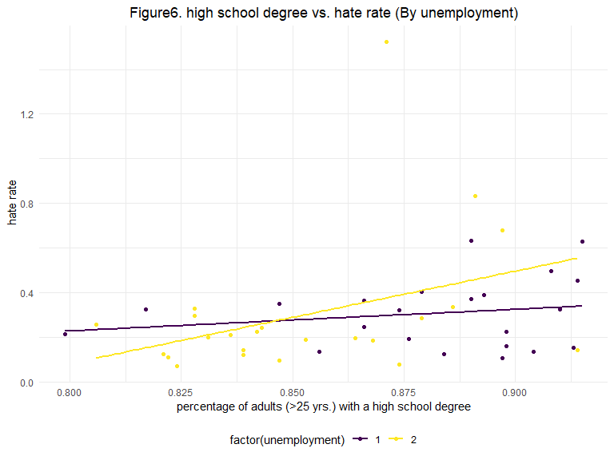
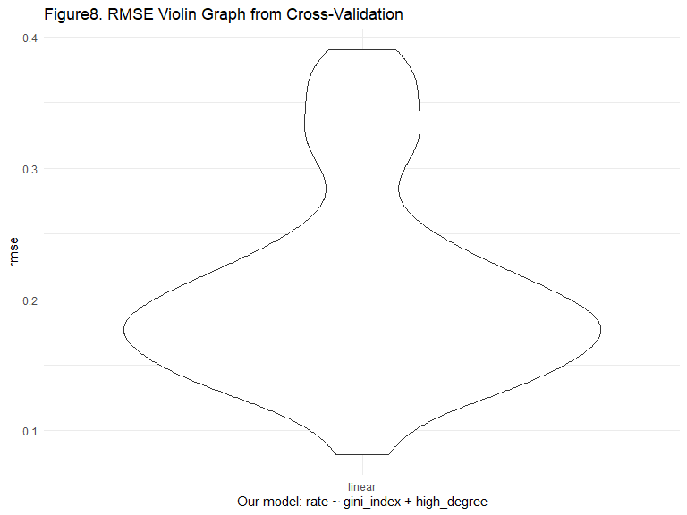

P8130 Final Project
================
Pengyuan Su (ps3195), Shuhong Xiang (sx2289), Yali Zhai (yz3959),
Zhixing Wu (zw2709)
12/6/2020

``` r
library(tidyverse)
library(modelr)
library(arsenal)
library(broom)
```

    ## 
    ## Attaching package: 'broom'

    ## The following object is masked from 'package:modelr':
    ## 
    ##     bootstrap

``` r
library(modelr)
library(patchwork)
library(mgcv)
```

    ## Loading required package: nlme

    ## 
    ## Attaching package: 'nlme'

    ## The following object is masked from 'package:dplyr':
    ## 
    ##     collapse

    ## This is mgcv 1.8-33. For overview type 'help("mgcv-package")'.

    ## 
    ## Attaching package: 'mgcv'

    ## The following object is masked from 'package:arsenal':
    ## 
    ##     negbin

``` r
library(faraway)
```

    ## Registered S3 methods overwritten by 'lme4':
    ##   method                          from
    ##   cooks.distance.influence.merMod car 
    ##   influence.merMod                car 
    ##   dfbeta.influence.merMod         car 
    ##   dfbetas.influence.merMod        car

    ## 
    ## Attaching package: 'faraway'

    ## The following object is masked from 'package:olsrr':
    ## 
    ##     hsb

``` r
library(skimr)
```

# Abstract

# Introduction

Hate crime is a significant issue under the present circumstances. There
exist multiple variables related to hate crime. In this project, we
intend to find the relationships between the hate crime rate and the
eight variables.

Among the eight variables, income status is about unemployment level,
medians of household income, and Gini index in the dataset. Especially,
the Gini index is a measure of the distribution of income across a
population developed by the Italian statistician Corrado Gini in 1912.
\[1\] In real life, the high-valued Gini index implies the high levels
of inequality in the whole society. Also, the high unemployment rate
will lower the medians of household income. People without employment
are more likely to participate in hate crime. \[2\] Besides, the
education level matters in income status. A higher level of education
status, like the high-school degree in this study, will lead to an
occupation with a higher salary, which can increase the medians of
household income and decrease unemployment.

Hate crime, according to website information
(<https://hatecrime.campaign.gov.uk/>), is regarded as the criminal
offence motivated by hostility or prejudice of others’ some
characteristics, including race, religion, sexual orientation,
transgender identity, disability. And our project mainly emphasizes on
the possible variables which might have close relation with the hate
crime rate.

The race consideration might become the most common cause of hate crime.
Based on the statistics provided
(<https://law.jrank.org/pages/12135/Race-Ethnicity-Hate-Crimes.html> ),
hate crimes resulting from race were about 49 percent in 2002 and 67
percent of victims attacked for racial problems were black Americans.

It is pointed out in this
article(<https://www.assignmentpoint.com/arts/social-science/the-role-of-urbanization-in-increasing-crime-in-urban-area-2.html>)
that the crime and urbanization seem to be correlated in terms of
sociological aspects since it have be linked between criminal cases and
the socio-economic development levels.

<https://safer-america.com/map-of-reported-hate-crimes-in-the-u-s-a/>
According to the Uniform Crime Reporting Program’s Hate Crime Statistics
Program, all the hate crimes reported to the FBI in 2017 of all the
states except Hawaii were shown, and the Pennsylvania had 1488 cases and
ranked the first. While in terms of the Hate Crimes per 100,000, the
District of Columbia had the largest figure of 27.81.

# Data Analysis

## Tidy:

`rate`: hate\_crimes\_per\_100k\_splc

`med_income`: median\_household\_income

`high_degree`: perc\_population\_with\_high\_school\_degree

`non_citizen`: perc\_non\_citizen

`non_white`: perc\_non\_white

``` r
hc_df = 
  read_csv(here::here("data/HateCrimes.csv")) %>% 
  janitor::clean_names() %>% 
  mutate(hate_crimes_per_100k_splc = as.numeric(hate_crimes_per_100k_splc)) %>% 
  drop_na() %>% 
  rename(., 
         rate = hate_crimes_per_100k_splc, 
         med_income = median_household_income, 
         high_degree = perc_population_with_high_school_degree, 
         non_citizen = perc_non_citizen, 
         non_white = perc_non_white)
```

    ## 
    ## -- Column specification --------------------------------------------------------
    ## cols(
    ##   state = col_character(),
    ##   unemployment = col_character(),
    ##   urbanization = col_character(),
    ##   median_household_income = col_double(),
    ##   perc_population_with_high_school_degree = col_double(),
    ##   perc_non_citizen = col_double(),
    ##   gini_index = col_double(),
    ##   perc_non_white = col_double(),
    ##   hate_crimes_per_100k_splc = col_character()
    ## )

``` r
head(hc_df)
```

    ## # A tibble: 6 x 9
    ##   state unemployment urbanization med_income high_degree non_citizen gini_index
    ##   <chr> <chr>        <chr>             <dbl>       <dbl>       <dbl>      <dbl>
    ## 1 Alab~ high         low               42278       0.821        0.02      0.472
    ## 2 Alas~ high         low               67629       0.914        0.04      0.422
    ## 3 Ariz~ high         high              49254       0.842        0.1       0.455
    ## 4 Arka~ high         low               44922       0.824        0.04      0.458
    ## 5 Cali~ high         high              60487       0.806        0.13      0.471
    ## 6 Colo~ low          high              60940       0.893        0.06      0.457
    ## # ... with 2 more variables: non_white <dbl>, rate <dbl>

Description by table?

``` r
skim(hc_df)
```

|                                                  |        |
| :----------------------------------------------- | :----- |
| Name                                             | hc\_df |
| Number of rows                                   | 45     |
| Number of columns                                | 9      |
| \_\_\_\_\_\_\_\_\_\_\_\_\_\_\_\_\_\_\_\_\_\_\_   |        |
| Column type frequency:                           |        |
| character                                        | 3      |
| numeric                                          | 6      |
| \_\_\_\_\_\_\_\_\_\_\_\_\_\_\_\_\_\_\_\_\_\_\_\_ |        |
| Group variables                                  | None   |

Data summary

**Variable type: character**

| skim\_variable | n\_missing | complete\_rate | min | max | empty | n\_unique | whitespace |
| :------------- | ---------: | -------------: | --: | --: | ----: | --------: | ---------: |
| state          |          0 |              1 |   4 |  20 |     0 |        45 |          0 |
| unemployment   |          0 |              1 |   3 |   4 |     0 |         2 |          0 |
| urbanization   |          0 |              1 |   3 |   4 |     0 |         2 |          0 |

**Variable type: numeric**

| skim\_variable | n\_missing | complete\_rate |     mean |      sd |       p0 |      p25 |      p50 |      p75 |     p100 | hist  |
| :------------- | ---------: | -------------: | -------: | ------: | -------: | -------: | -------: | -------: | -------: | :---- |
| med\_income    |          0 |              1 | 55299.49 | 8979.49 | 39552.00 | 48060.00 | 54916.00 | 60708.00 | 76165.00 | ▆▆▇▃▂ |
| high\_degree   |          0 |              1 |     0.87 |    0.03 |     0.80 |     0.84 |     0.87 |     0.89 |     0.92 | ▃▆▅▇▇ |
| non\_citizen   |          0 |              1 |     0.06 |    0.03 |     0.01 |     0.03 |     0.05 |     0.08 |     0.13 | ▇▇▆▃▂ |
| gini\_index    |          0 |              1 |     0.46 |    0.02 |     0.42 |     0.44 |     0.46 |     0.47 |     0.53 | ▅▇▅▁▁ |
| non\_white     |          0 |              1 |     0.32 |    0.15 |     0.06 |     0.21 |     0.30 |     0.42 |     0.63 | ▃▇▅▅▂ |
| rate           |          0 |              1 |     0.30 |    0.25 |     0.07 |     0.14 |     0.23 |     0.35 |     1.52 | ▇▂▁▁▁ |

### change “unemployment” and “urbanization” from characters to corresponding numbers “1”,“2”

use 1 and 2 to denote the level low and high

``` r
hc_df = 
  hc_df %>% 
  mutate(
    unemployment = case_when(
      unemployment == "low" ~ 1,
      unemployment == "high" ~ 2)
  ) %>% 
  mutate(
    urbanization = case_when(
      urbanization == "low" ~ 1,
      urbanization == "high" ~ 2)
  ) %>% 
  
  select(-state)
```

## Plot distribution of hate crimes rate

``` r
hc_df %>% 
  ggplot(aes(x = rate, y = ..density..)) +
  geom_histogram(fill = "blue", alpha = .4) +
  geom_density(aes( x = rate, y = ..density..)) +
  theme_bw() +
  labs(title = "Figure1. Distribution for hate crimes per 100k",
       x = "hate crimes per 100k splc",
       y = " Count") +
  theme(plot.title = element_text(hjust = .5 ))
```

    ## `stat_bin()` using `bins = 30`. Pick better value with `binwidth`.


``` r
hc_df_log = 
  hc_df %>% 
  mutate(lg = log(rate)) %>% 
  select(-rate)

hc_df_log%>% 
  ggplot(aes(x = lg, y = ..density..)) +
  geom_histogram(fill = "blue", alpha = .4, binwidth = 0.2) +
  geom_density(aes( lg, y = ..density..)) +
  theme_bw() +
  labs(title = "Figure2. Distribution for Log ",
       x = "Log (hate crimes per 100k splc)",
       y = " Count") +
  theme(plot.title = element_text(hjust = .5 ))
```


``` r
# Create a quantile-quantile plot (QQplot)
qqnorm(hc_df_log$lg, col=2, pch=19, cex=1.5, main = "Figure3. Normal Q-Q Plot")

# Add a straight line which passes through the first and third quartiles.
qqline(hc_df_log$lg, col = 1,lwd=2,lty=2)
```


Based on the QQ plot in terms of the log(hate crimes per 100k splc), the
points are nearly distributed along the straight line, so there is not
severe departure from the normality.

``` r
# Perform Shapiro-Wilk test
shapiro.test(hc_df_log$lg) 
```

    ## 
    ##  Shapiro-Wilk normality test
    ## 
    ## data:  hc_df_log$lg
    ## W = 0.98308, p-value = 0.7453

H0: the log(hate crimes per 100k splc) is normally distributed H1: the
log(hate crimes per 100k splc) is not normally distributed

The W test statistic is 0.983 with p value of 0.7453.

Since the p value is greater than 0.05, so we fail to reject the null
and we could conclude that the log(hate crimes per 100k splc) seems to
be normally distributed under the significance level of 5%.

## Correlation

``` r
hc_df %>% cor() %>% round(., 2)
```

    ##              unemployment urbanization med_income high_degree non_citizen
    ## unemployment         1.00         0.24      -0.25       -0.45        0.24
    ## urbanization         0.24         1.00       0.26       -0.16        0.68
    ## med_income          -0.25         0.26       1.00        0.65        0.30
    ## high_degree         -0.45        -0.16       0.65        1.00       -0.26
    ## non_citizen          0.24         0.68       0.30       -0.26        1.00
    ## gini_index           0.41         0.43      -0.13       -0.54        0.48
    ## non_white            0.43         0.51       0.04       -0.50        0.75
    ## rate                -0.02         0.21       0.34        0.26        0.24
    ##              gini_index non_white  rate
    ## unemployment       0.41      0.43 -0.02
    ## urbanization       0.43      0.51  0.21
    ## med_income        -0.13      0.04  0.34
    ## high_degree       -0.54     -0.50  0.26
    ## non_citizen        0.48      0.75  0.24
    ## gini_index         1.00      0.55  0.38
    ## non_white          0.55      1.00  0.11
    ## rate               0.38      0.11  1.00

## Verify association

**income**

``` r
income = 
 lm(rate ~ med_income, data = hc_df)
summary(income)
```

    ## 
    ## Call:
    ## lm(formula = rate ~ med_income, data = hc_df)
    ## 
    ## Residuals:
    ##      Min       1Q   Median       3Q      Max 
    ## -0.32518 -0.12668 -0.04373  0.05772  1.09488 
    ## 
    ## Coefficients:
    ##               Estimate Std. Error t value Pr(>|t|)  
    ## (Intercept) -2.302e-01  2.247e-01  -1.024   0.3114  
    ## med_income   9.631e-06  4.012e-06   2.401   0.0208 *
    ## ---
    ## Signif. codes:  0 '***' 0.001 '**' 0.01 '*' 0.05 '.' 0.1 ' ' 1
    ## 
    ## Residual standard error: 0.239 on 43 degrees of freedom
    ## Multiple R-squared:  0.1182, Adjusted R-squared:  0.09768 
    ## F-statistic: 5.763 on 1 and 43 DF,  p-value: 0.02076

**high school degree**

``` r
degree = 
 lm(rate ~ high_degree, data = hc_df)

summary(degree)
```

    ## 
    ## Call:
    ## lm(formula = rate ~ high_degree, data = hc_df)
    ## 
    ## Residuals:
    ##      Min       1Q   Median       3Q      Max 
    ## -0.25882 -0.13075 -0.03059  0.07053  1.21096 
    ## 
    ## Coefficients:
    ##             Estimate Std. Error t value Pr(>|t|)  
    ## (Intercept)  -1.4520     0.9829  -1.477   0.1469  
    ## high_degree   2.0245     1.1334   1.786   0.0811 .
    ## ---
    ## Signif. codes:  0 '***' 0.001 '**' 0.01 '*' 0.05 '.' 0.1 ' ' 1
    ## 
    ## Residual standard error: 0.2455 on 43 degrees of freedom
    ## Multiple R-squared:  0.06907,    Adjusted R-squared:  0.04742 
    ## F-statistic: 3.191 on 1 and 43 DF,  p-value: 0.08112

**non citizen**

``` r
noncitizen = 
 lm(rate ~ non_citizen, data = hc_df)

summary(noncitizen)
```

    ## 
    ## Call:
    ## lm(formula = rate ~ non_citizen, data = hc_df)
    ## 
    ## Residuals:
    ##      Min       1Q   Median       3Q      Max 
    ## -0.33134 -0.13873 -0.04796  0.07165  1.11265 
    ## 
    ## Coefficients:
    ##             Estimate Std. Error t value Pr(>|t|)  
    ## (Intercept)  0.19390    0.07549   2.568   0.0138 *
    ## non_citizen  1.96134    1.19134   1.646   0.1070  
    ## ---
    ## Signif. codes:  0 '***' 0.001 '**' 0.01 '*' 0.05 '.' 0.1 ' ' 1
    ## 
    ## Residual standard error: 0.2468 on 43 degrees of freedom
    ## Multiple R-squared:  0.0593, Adjusted R-squared:  0.03742 
    ## F-statistic:  2.71 on 1 and 43 DF,  p-value: 0.107

**non white**

``` r
nonwhite = 
 lm(rate ~ non_white, data = hc_df)

summary(nonwhite)
```

    ## 
    ## Call:
    ## lm(formula = rate ~ non_white, data = hc_df)
    ## 
    ## Residuals:
    ##      Min       1Q   Median       3Q      Max 
    ## -0.24715 -0.14189 -0.09149  0.05348  1.16111 
    ## 
    ## Coefficients:
    ##             Estimate Std. Error t value Pr(>|t|)   
    ## (Intercept)  0.24271    0.08973   2.705  0.00975 **
    ## non_white    0.18807    0.25640   0.734  0.46723   
    ## ---
    ## Signif. codes:  0 '***' 0.001 '**' 0.01 '*' 0.05 '.' 0.1 ' ' 1
    ## 
    ## Residual standard error: 0.2529 on 43 degrees of freedom
    ## Multiple R-squared:  0.01236,    Adjusted R-squared:  -0.01061 
    ## F-statistic: 0.538 on 1 and 43 DF,  p-value: 0.4672

**gini index**

``` r
gini = 
 lm(rate ~ gini_index, data = hc_df)

summary(gini)
```

    ## 
    ## Call:
    ## lm(formula = rate ~ gini_index, data = hc_df)
    ## 
    ## Residuals:
    ##      Min       1Q   Median       3Q      Max 
    ## -0.28113 -0.14973 -0.04568  0.07525  0.87041 
    ## 
    ## Coefficients:
    ##             Estimate Std. Error t value Pr(>|t|)   
    ## (Intercept)  -1.7844     0.7742  -2.305  0.02608 * 
    ## gini_index    4.5794     1.6973   2.698  0.00992 **
    ## ---
    ## Signif. codes:  0 '***' 0.001 '**' 0.01 '*' 0.05 '.' 0.1 ' ' 1
    ## 
    ## Residual standard error: 0.2353 on 43 degrees of freedom
    ## Multiple R-squared:  0.1448, Adjusted R-squared:  0.1249 
    ## F-statistic:  7.28 on 1 and 43 DF,  p-value: 0.009924

**unemployment**

``` r
unemployment = 
 lm(rate ~ unemployment, data = hc_df)

summary(unemployment)
```

    ## 
    ## Call:
    ## lm(formula = rate ~ unemployment, data = hc_df)
    ## 
    ## Residuals:
    ##      Min       1Q   Median       3Q      Max 
    ## -0.22934 -0.15510 -0.07308  0.04398  1.22390 
    ## 
    ## Coefficients:
    ##               Estimate Std. Error t value Pr(>|t|)  
    ## (Intercept)   0.314893   0.120769   2.607   0.0125 *
    ## unemployment -0.008248   0.075877  -0.109   0.9139  
    ## ---
    ## Signif. codes:  0 '***' 0.001 '**' 0.01 '*' 0.05 '.' 0.1 ' ' 1
    ## 
    ## Residual standard error: 0.2544 on 43 degrees of freedom
    ## Multiple R-squared:  0.0002747,  Adjusted R-squared:  -0.02297 
    ## F-statistic: 0.01182 on 1 and 43 DF,  p-value: 0.9139

**urbanization**

``` r
urbanization = 
 lm(rate ~ urbanization, data = hc_df)

summary(urbanization)
```

    ## 
    ## Call:
    ## lm(formula = rate ~ urbanization, data = hc_df)
    ## 
    ## Residuals:
    ##      Min       1Q   Median       3Q      Max 
    ## -0.27357 -0.13829 -0.05521  0.04889  1.17043 
    ## 
    ## Coefficients:
    ##              Estimate Std. Error t value Pr(>|t|)
    ## (Intercept)    0.1400     0.1198   1.168    0.249
    ## urbanization   0.1059     0.0743   1.426    0.161
    ## 
    ## Residual standard error: 0.2487 on 43 degrees of freedom
    ## Multiple R-squared:  0.04515,    Adjusted R-squared:  0.02294 
    ## F-statistic: 2.033 on 1 and 43 DF,  p-value: 0.1611

We conduct the linear regression between Y and all variables X
individuals, and the variable “med\_income” and “gini\_index” seem to be
significant with p value smaller than 0.05.

Since “med\_income” and “gini\_index” are significant predictors, then
we use these two predictors as the basis of the model to explore further
associations.

## use “gini\_index” as the model basis

``` r
# step1
fit1 <- lm(rate ~ unemployment, data = hc_df)
tidy(fit1)
```

    ## # A tibble: 2 x 5
    ##   term         estimate std.error statistic p.value
    ##   <chr>           <dbl>     <dbl>     <dbl>   <dbl>
    ## 1 (Intercept)   0.315      0.121      2.61   0.0125
    ## 2 unemployment -0.00825    0.0759    -0.109  0.914

``` r
fit2 <- lm(rate ~ urbanization, data = hc_df)
tidy(fit2)
```

    ## # A tibble: 2 x 5
    ##   term         estimate std.error statistic p.value
    ##   <chr>           <dbl>     <dbl>     <dbl>   <dbl>
    ## 1 (Intercept)     0.140    0.120       1.17   0.249
    ## 2 urbanization    0.106    0.0743      1.43   0.161

``` r
fit3 <- lm(rate ~ med_income, data = hc_df)
tidy(fit3)
```

    ## # A tibble: 2 x 5
    ##   term           estimate  std.error statistic p.value
    ##   <chr>             <dbl>      <dbl>     <dbl>   <dbl>
    ## 1 (Intercept) -0.230      0.225          -1.02  0.311 
    ## 2 med_income   0.00000963 0.00000401      2.40  0.0208

``` r
fit4 <- lm(rate ~ high_degree, data = hc_df)
tidy(fit4)
```

    ## # A tibble: 2 x 5
    ##   term        estimate std.error statistic p.value
    ##   <chr>          <dbl>     <dbl>     <dbl>   <dbl>
    ## 1 (Intercept)    -1.45     0.983     -1.48  0.147 
    ## 2 high_degree     2.02     1.13       1.79  0.0811

``` r
fit5 <- lm(rate ~ non_citizen, data = hc_df)
tidy(fit5)
```

    ## # A tibble: 2 x 5
    ##   term        estimate std.error statistic p.value
    ##   <chr>          <dbl>     <dbl>     <dbl>   <dbl>
    ## 1 (Intercept)    0.194    0.0755      2.57  0.0138
    ## 2 non_citizen    1.96     1.19        1.65  0.107

``` r
fit6 <- lm(rate ~ gini_index, data = hc_df)
tidy(fit6)
```

    ## # A tibble: 2 x 5
    ##   term        estimate std.error statistic p.value
    ##   <chr>          <dbl>     <dbl>     <dbl>   <dbl>
    ## 1 (Intercept)    -1.78     0.774     -2.30 0.0261 
    ## 2 gini_index      4.58     1.70       2.70 0.00992

``` r
fit7 <- lm(rate ~ non_white, data = hc_df)
tidy(fit7)
```

    ## # A tibble: 2 x 5
    ##   term        estimate std.error statistic p.value
    ##   <chr>          <dbl>     <dbl>     <dbl>   <dbl>
    ## 1 (Intercept)    0.243    0.0897     2.70  0.00975
    ## 2 non_white      0.188    0.256      0.734 0.467

``` r
forward1 = lm(rate ~ gini_index, data = hc_df)

# step 2
fit1 <- update(forward1, . ~ . +unemployment)
tidy(fit1)
```

    ## # A tibble: 3 x 5
    ##   term         estimate std.error statistic p.value
    ##   <chr>           <dbl>     <dbl>     <dbl>   <dbl>
    ## 1 (Intercept)    -2.09     0.800      -2.62 0.0123 
    ## 2 gini_index      5.60     1.84        3.04 0.00408
    ## 3 unemployment   -0.103    0.0762     -1.35 0.184

``` r
fit2 <- update(forward1, . ~ . +urbanization)
tidy(fit2)
```

    ## # A tibble: 3 x 5
    ##   term         estimate std.error statistic p.value
    ##   <chr>           <dbl>     <dbl>     <dbl>   <dbl>
    ## 1 (Intercept)   -1.69      0.821     -2.06   0.0460
    ## 2 gini_index     4.27      1.90       2.25   0.0299
    ## 3 urbanization   0.0299    0.0787     0.380  0.706

``` r
fit3 <- update(forward1, . ~ . +med_income)
tidy(fit3)
```

    ## # A tibble: 3 x 5
    ##   term          estimate  std.error statistic p.value
    ##   <chr>            <dbl>      <dbl>     <dbl>   <dbl>
    ## 1 (Intercept) -2.69      0.766          -3.51 0.00109
    ## 2 gini_index   5.20      1.56            3.32 0.00184
    ## 3 med_income   0.0000112 0.00000364      3.07 0.00369

``` r
fit4 <- update(forward1, . ~ . +high_degree)
tidy(fit4)
```

    ## # A tibble: 3 x 5
    ##   term        estimate std.error statistic    p.value
    ##   <chr>          <dbl>     <dbl>     <dbl>      <dbl>
    ## 1 (Intercept)    -8.10      1.45     -5.60 0.00000148
    ## 2 gini_index      8.82      1.63      5.41 0.00000276
    ## 3 high_degree     5.06      1.04      4.85 0.0000174

``` r
fit5 <- update(forward1, . ~ . +non_citizen)
tidy(fit5)
```

    ## # A tibble: 3 x 5
    ##   term        estimate std.error statistic p.value
    ##   <chr>          <dbl>     <dbl>     <dbl>   <dbl>
    ## 1 (Intercept)   -1.61      0.858    -1.88   0.0673
    ## 2 gini_index     4.12      1.95      2.11   0.0407
    ## 3 non_citizen    0.637     1.31      0.488  0.628

``` r
fit6 <- update(forward1, . ~ . +non_white)
tidy(fit6)
```

    ## # A tibble: 3 x 5
    ##   term        estimate std.error statistic p.value
    ##   <chr>          <dbl>     <dbl>     <dbl>   <dbl>
    ## 1 (Intercept)   -2.13      0.883    -2.41  0.0203 
    ## 2 gini_index     5.50      2.04      2.70  0.00997
    ## 3 non_white     -0.236     0.286    -0.824 0.415

``` r
forward2 = update(forward1, . ~ . +high_degree)

#step 3
fit1 <- update(forward2, . ~ . +unemployment)
tidy(fit1)
```

    ## # A tibble: 4 x 5
    ##   term         estimate std.error statistic    p.value
    ##   <chr>           <dbl>     <dbl>     <dbl>      <dbl>
    ## 1 (Intercept)   -8.06      1.48      -5.45  0.00000264
    ## 2 gini_index     8.90      1.69       5.26  0.00000483
    ## 3 high_degree    4.99      1.11       4.51  0.0000536 
    ## 4 unemployment  -0.0126    0.0661    -0.191 0.849

``` r
fit2 <- update(forward2, . ~ . +urbanization)
tidy(fit2)
```

    ## # A tibble: 4 x 5
    ##   term         estimate std.error statistic    p.value
    ##   <chr>           <dbl>     <dbl>     <dbl>      <dbl>
    ## 1 (Intercept)  -8.10       1.50     -5.40   0.00000312
    ## 2 gini_index    8.81       1.81      4.86   0.0000175 
    ## 3 high_degree   5.06       1.06      4.77   0.0000237 
    ## 4 urbanization  0.00111    0.0642    0.0174 0.986

``` r
fit3 <- update(forward2, . ~ . +med_income)
tidy(fit3)
```

    ## # A tibble: 4 x 5
    ##   term            estimate  std.error statistic   p.value
    ##   <chr>              <dbl>      <dbl>     <dbl>     <dbl>
    ## 1 (Intercept) -7.98        1.72          -4.63  0.0000365
    ## 2 gini_index   8.74        1.76           4.98  0.0000121
    ## 3 high_degree  4.92        1.47           3.35  0.00175  
    ## 4 med_income   0.000000616 0.00000455     0.135 0.893

``` r
fit4 <- update(forward2, . ~ . +non_citizen)
tidy(fit4)
```

    ## # A tibble: 4 x 5
    ##   term        estimate std.error statistic    p.value
    ##   <chr>          <dbl>     <dbl>     <dbl>      <dbl>
    ## 1 (Intercept)   -7.93       1.48    -5.34  0.00000370
    ## 2 gini_index     8.35       1.81     4.62  0.0000375 
    ## 3 high_degree    5.06       1.05     4.82  0.0000202 
    ## 4 non_citizen    0.667      1.06     0.631 0.531

``` r
fit5 <- update(forward2, . ~ . +non_white)
tidy(fit5)
```

    ## # A tibble: 4 x 5
    ##   term        estimate std.error statistic    p.value
    ##   <chr>          <dbl>     <dbl>     <dbl>      <dbl>
    ## 1 (Intercept)  -8.12       1.46     -5.55  0.00000188
    ## 2 gini_index    8.57       1.79      4.80  0.0000213 
    ## 3 high_degree   5.18       1.10      4.71  0.0000288 
    ## 4 non_white     0.0914     0.244     0.375 0.710

Based on the results, the significant predictors are “gini\_index” and
“high\_degree”.

## use “med\_income” as the model basis

``` r
income_reg = lm(rate ~ med_income, data = hc_df)
# step 1
fit1 <- update(income_reg, . ~ . +unemployment)
tidy(fit1)
```

    ## # A tibble: 3 x 5
    ##   term           estimate  std.error statistic p.value
    ##   <chr>             <dbl>      <dbl>     <dbl>   <dbl>
    ## 1 (Intercept)  -0.317     0.284         -1.12   0.271 
    ## 2 med_income    0.0000102 0.00000418     2.43   0.0194
    ## 3 unemployment  0.0376    0.0743         0.506  0.616

``` r
fit2 <- update(income_reg, . ~ . +urbanization)
tidy(fit2)
```

    ## # A tibble: 3 x 5
    ##   term            estimate  std.error statistic p.value
    ##   <chr>              <dbl>      <dbl>     <dbl>   <dbl>
    ## 1 (Intercept)  -0.278      0.232         -1.20   0.237 
    ## 2 med_income    0.00000867 0.00000417     2.08   0.0437
    ## 3 urbanization  0.0656     0.0742         0.885  0.381

``` r
fit3 <- update(income_reg, . ~ . +gini_index)
tidy(fit3)
```

    ## # A tibble: 3 x 5
    ##   term          estimate  std.error statistic p.value
    ##   <chr>            <dbl>      <dbl>     <dbl>   <dbl>
    ## 1 (Intercept) -2.69      0.766          -3.51 0.00109
    ## 2 med_income   0.0000112 0.00000364      3.07 0.00369
    ## 3 gini_index   5.20      1.56            3.32 0.00184

``` r
fit4 <- update(income_reg, . ~ . +high_degree)
tidy(fit4)
```

    ## # A tibble: 3 x 5
    ##   term           estimate  std.error statistic p.value
    ##   <chr>             <dbl>      <dbl>     <dbl>   <dbl>
    ## 1 (Intercept) -0.614      1.10          -0.556   0.581
    ## 2 med_income   0.00000840 0.00000534     1.57    0.123
    ## 3 high_degree  0.521      1.47           0.355   0.724

``` r
fit5 <- update(income_reg, . ~ . +non_citizen)
tidy(fit5)
```

    ## # A tibble: 3 x 5
    ##   term           estimate  std.error statistic p.value
    ##   <chr>             <dbl>      <dbl>     <dbl>   <dbl>
    ## 1 (Intercept) -0.227      0.225          -1.01  0.318 
    ## 2 med_income   0.00000833 0.00000421      1.98  0.0542
    ## 3 non_citizen  1.24       1.21            1.02  0.312

``` r
fit6 <- update(income_reg, . ~ . +non_white)
tidy(fit6) 
```

    ## # A tibble: 3 x 5
    ##   term           estimate  std.error statistic p.value
    ##   <chr>             <dbl>      <dbl>     <dbl>   <dbl>
    ## 1 (Intercept) -0.277      0.236         -1.17   0.248 
    ## 2 med_income   0.00000952 0.00000404     2.36   0.0231
    ## 3 non_white    0.166      0.244          0.679  0.501

``` r
forward1 = update(income_reg, . ~ . +gini_index)

#step 2
fit1 <- update(forward1, . ~ . +unemployment)
tidy(fit1)
```

    ## # A tibble: 4 x 5
    ##   term           estimate  std.error statistic  p.value
    ##   <chr>             <dbl>      <dbl>     <dbl>    <dbl>
    ## 1 (Intercept)  -2.81      0.784         -3.58  0.000901
    ## 2 med_income    0.0000105 0.00000375     2.81  0.00760 
    ## 3 gini_index    5.74      1.71           3.36  0.00170 
    ## 4 unemployment -0.0578    0.0724        -0.798 0.430

``` r
fit2 <- update(forward1, . ~ . +urbanization)
tidy(fit2)
```

    ## # A tibble: 4 x 5
    ##   term           estimate  std.error statistic p.value
    ##   <chr>             <dbl>      <dbl>     <dbl>   <dbl>
    ## 1 (Intercept)  -2.94      0.849         -3.46  0.00126
    ## 2 med_income    0.0000122 0.00000392     3.11  0.00340
    ## 3 gini_index    5.82      1.80           3.24  0.00240
    ## 4 urbanization -0.0544    0.0766        -0.711 0.481

``` r
fit3 <- update(forward1, . ~ . +high_degree)
tidy(fit3)
```

    ## # A tibble: 4 x 5
    ##   term            estimate  std.error statistic   p.value
    ##   <chr>              <dbl>      <dbl>     <dbl>     <dbl>
    ## 1 (Intercept) -7.98        1.72          -4.63  0.0000365
    ## 2 med_income   0.000000616 0.00000455     0.135 0.893    
    ## 3 gini_index   8.74        1.76           4.98  0.0000121
    ## 4 high_degree  4.92        1.47           3.35  0.00175

``` r
fit4 <- update(forward1, . ~ . +non_citizen)
tidy(fit4)
```

    ## # A tibble: 4 x 5
    ##   term          estimate  std.error statistic p.value
    ##   <chr>            <dbl>      <dbl>     <dbl>   <dbl>
    ## 1 (Intercept) -3.09      0.913         -3.39  0.00157
    ## 2 med_income   0.0000126 0.00000403     3.12  0.00326
    ## 3 gini_index   6.05      1.88           3.22  0.00252
    ## 4 non_citizen -1.07      1.31          -0.820 0.417

``` r
fit5 <- update(forward1, . ~ . +non_white)
tidy(fit5)
```

    ## # A tibble: 4 x 5
    ##   term          estimate  std.error statistic  p.value
    ##   <chr>            <dbl>      <dbl>     <dbl>    <dbl>
    ## 1 (Intercept) -3.25      0.868          -3.74 0.000556
    ## 2 med_income   0.0000118 0.00000364      3.25 0.00229 
    ## 3 gini_index   6.60      1.87            3.53 0.00104 
    ## 4 non_white   -0.349     0.261          -1.34 0.189

``` r
#delete med_income, add high_degree
forward2 = lm(rate~gini_index + high_degree, data = hc_df)

#step 3
fit1 <- update(forward2, . ~ . +unemployment)
tidy(fit1)
```

    ## # A tibble: 4 x 5
    ##   term         estimate std.error statistic    p.value
    ##   <chr>           <dbl>     <dbl>     <dbl>      <dbl>
    ## 1 (Intercept)   -8.06      1.48      -5.45  0.00000264
    ## 2 gini_index     8.90      1.69       5.26  0.00000483
    ## 3 high_degree    4.99      1.11       4.51  0.0000536 
    ## 4 unemployment  -0.0126    0.0661    -0.191 0.849

``` r
fit2 <- update(forward2, . ~ . +urbanization)
tidy(fit2)
```

    ## # A tibble: 4 x 5
    ##   term         estimate std.error statistic    p.value
    ##   <chr>           <dbl>     <dbl>     <dbl>      <dbl>
    ## 1 (Intercept)  -8.10       1.50     -5.40   0.00000312
    ## 2 gini_index    8.81       1.81      4.86   0.0000175 
    ## 3 high_degree   5.06       1.06      4.77   0.0000237 
    ## 4 urbanization  0.00111    0.0642    0.0174 0.986

``` r
fit3 <- update(forward2, . ~ . +non_white)
tidy(fit3)
```

    ## # A tibble: 4 x 5
    ##   term        estimate std.error statistic    p.value
    ##   <chr>          <dbl>     <dbl>     <dbl>      <dbl>
    ## 1 (Intercept)  -8.12       1.46     -5.55  0.00000188
    ## 2 gini_index    8.57       1.79      4.80  0.0000213 
    ## 3 high_degree   5.18       1.10      4.71  0.0000288 
    ## 4 non_white     0.0914     0.244     0.375 0.710

``` r
fit4 <- update(forward2, . ~ . +non_citizen)
tidy(fit4)
```

    ## # A tibble: 4 x 5
    ##   term        estimate std.error statistic    p.value
    ##   <chr>          <dbl>     <dbl>     <dbl>      <dbl>
    ## 1 (Intercept)   -7.93       1.48    -5.34  0.00000370
    ## 2 gini_index     8.35       1.81     4.62  0.0000375 
    ## 3 high_degree    5.06       1.05     4.82  0.0000202 
    ## 4 non_citizen    0.667      1.06     0.631 0.531

Based on the results, the significant predictors are “gini\_index” and
“high\_degree”.

## Stepwise method

``` r
mult.fit = lm(rate ~ ., data = hc_df)
step(mult.fit, direction='backward')
```

    ## Start:  AIC=-137.03
    ## rate ~ unemployment + urbanization + med_income + high_degree + 
    ##     non_citizen + gini_index + non_white
    ## 
    ##                Df Sum of Sq    RSS     AIC
    ## - non_white     1   0.00001 1.5008 -139.03
    ## - unemployment  1   0.00135 1.5021 -138.99
    ## - med_income    1   0.00258 1.5034 -138.95
    ## - urbanization  1   0.00618 1.5070 -138.85
    ## - non_citizen   1   0.01750 1.5183 -138.51
    ## <none>                      1.5008 -137.03
    ## - high_degree   1   0.34889 1.8497 -129.62
    ## - gini_index    1   0.77465 2.2754 -120.30
    ## 
    ## Step:  AIC=-139.03
    ## rate ~ unemployment + urbanization + med_income + high_degree + 
    ##     non_citizen + gini_index
    ## 
    ##                Df Sum of Sq    RSS     AIC
    ## - unemployment  1   0.00148 1.5023 -140.99
    ## - med_income    1   0.00269 1.5035 -140.95
    ## - urbanization  1   0.00617 1.5070 -140.85
    ## - non_citizen   1   0.02422 1.5250 -140.31
    ## <none>                      1.5008 -139.03
    ## - high_degree   1   0.38759 1.8884 -130.69
    ## - gini_index    1   0.77888 2.2797 -122.22
    ## 
    ## Step:  AIC=-140.99
    ## rate ~ urbanization + med_income + high_degree + non_citizen + 
    ##     gini_index
    ## 
    ##                Df Sum of Sq    RSS     AIC
    ## - med_income    1   0.00243 1.5047 -142.91
    ## - urbanization  1   0.00693 1.5092 -142.78
    ## - non_citizen   1   0.02401 1.5263 -142.27
    ## <none>                      1.5023 -140.99
    ## - high_degree   1   0.40517 1.9074 -132.24
    ## - gini_index    1   0.78876 2.2910 -124.00
    ## 
    ## Step:  AIC=-142.91
    ## rate ~ urbanization + high_degree + non_citizen + gini_index
    ## 
    ##                Df Sum of Sq    RSS     AIC
    ## - urbanization  1   0.00762 1.5123 -144.69
    ## - non_citizen   1   0.02232 1.5270 -144.25
    ## <none>                      1.5047 -142.91
    ## - gini_index    1   0.78737 2.2921 -125.97
    ## - high_degree   1   0.86254 2.3672 -124.52
    ## 
    ## Step:  AIC=-144.69
    ## rate ~ high_degree + non_citizen + gini_index
    ## 
    ##               Df Sum of Sq    RSS     AIC
    ## - non_citizen  1   0.01471 1.5270 -146.25
    ## <none>                     1.5123 -144.69
    ## - gini_index   1   0.78804 2.3004 -127.81
    ## - high_degree  1   0.85561 2.3679 -126.51
    ## 
    ## Step:  AIC=-146.25
    ## rate ~ high_degree + gini_index
    ## 
    ##               Df Sum of Sq    RSS     AIC
    ## <none>                     1.5270 -146.25
    ## - high_degree  1   0.85432 2.3813 -128.25
    ## - gini_index   1   1.06513 2.5922 -124.44

    ## 
    ## Call:
    ## lm(formula = rate ~ high_degree + gini_index, data = hc_df)
    ## 
    ## Coefficients:
    ## (Intercept)  high_degree   gini_index  
    ##      -8.103        5.059        8.825

The stepwise method shows the relationship； rate \~ high\_degree +
gini\_index.

The results are similar to the previous model, showing the
“high\_degree” and “gini\_index” are significant.

# Interaction check

urbanization & high\_degree

``` r
##Urbanization -- high_degree
hc_df %>% 
  ggplot(aes(x = high_degree, y = rate, color = factor(urbanization))) +
  geom_point() +
  stat_smooth(method = "lm", se = F) +
  labs(title = "Figure4. high school degree vs. hate rate (By urbanization)",
       x = "percentage of adults (>25 yrs.) with a high school degree",
       y = " hate rate") +
  theme(plot.title = element_text(hjust = .5 ))
```

    ## `geom_smooth()` using formula 'y ~ x'


urbanization & gini\_index

``` r
##Urbanization -- gini
hc_df %>% 
  ggplot(aes(x = gini_index, y = rate, color = factor(urbanization))) +
  geom_point() +
  stat_smooth(method = "lm", se = F) +
  labs(title = "Figure5. gini index vs. hate rate (By urbanization)",
       x = "gini index",
       y = " hate rate") +
  theme(plot.title = element_text(hjust = .5 ))
```

    ## `geom_smooth()` using formula 'y ~ x'


unemployment & high\_degree

``` r
##Unemployment -- high_degree
hc_df %>% 
  ggplot(aes(x = high_degree, y = rate, color = factor(unemployment))) +
  geom_point() +
  stat_smooth(method = "lm", se = F) +
  labs(title = "Figure6. high school degree vs. hate rate (By unemployment)",
       x = "percentage of adults (>25 yrs.) with a high school degree",
       y = " hate rate") +
  theme(plot.title = element_text(hjust = .5 ))
```

    ## `geom_smooth()` using formula 'y ~ x'


unemployment & gini

``` r
##Unemployment -- gini
hc_df %>% 
  ggplot(aes(x = gini_index, y = rate, color = factor(unemployment))) +
  geom_point() +
  stat_smooth(method = "lm", se = F) +
  labs(title = "Figure7. gini index vs. hate rate (By unemployment)",
       x = "gini index",
       y = " hate rate") +
  theme(plot.title = element_text(hjust = .5 ))
```

    ## `geom_smooth()` using formula 'y ~ x'



We check the interaction for `urbanization` and `unemployment` among
`high_degree`, and `gini_index` and find that the two variables have
interactions with urbanization and unemployment. Next step, we will
check whether the interaction term is significant.

# add interaction to model and check significance

initial:

``` r
model = 
  hc_df %>% 
  lm(rate ~ high_degree + gini_index, data = .)

summary(model)
```

    ## 
    ## Call:
    ## lm(formula = rate ~ high_degree + gini_index, data = .)
    ## 
    ## Residuals:
    ##      Min       1Q   Median       3Q      Max 
    ## -0.33490 -0.11891 -0.03105  0.11430  0.52418 
    ## 
    ## Coefficients:
    ##             Estimate Std. Error t value Pr(>|t|)    
    ## (Intercept)   -8.103      1.447  -5.601 1.48e-06 ***
    ## high_degree    5.059      1.044   4.847 1.74e-05 ***
    ## gini_index     8.825      1.630   5.413 2.76e-06 ***
    ## ---
    ## Signif. codes:  0 '***' 0.001 '**' 0.01 '*' 0.05 '.' 0.1 ' ' 1
    ## 
    ## Residual standard error: 0.1907 on 42 degrees of freedom
    ## Multiple R-squared:  0.4516, Adjusted R-squared:  0.4255 
    ## F-statistic: 17.29 on 2 and 42 DF,  p-value: 3.32e-06

add interaction:

1.  check for adding all interactions for the two models

<!-- end list -->

``` r
inter_model_1= 
  hc_df %>% 
  lm(rate ~ high_degree * gini_index * urbanization , data = .)

summary(inter_model_1)
```

    ## 
    ## Call:
    ## lm(formula = rate ~ high_degree * gini_index * urbanization, 
    ##     data = .)
    ## 
    ## Residuals:
    ##      Min       1Q   Median       3Q      Max 
    ## -0.34687 -0.11903 -0.00746  0.10249  0.49588 
    ## 
    ## Coefficients:
    ##                                     Estimate Std. Error t value Pr(>|t|)
    ## (Intercept)                           -8.662    103.037  -0.084    0.933
    ## high_degree                           10.261    116.565   0.088    0.930
    ## gini_index                            22.075    226.006   0.098    0.923
    ## urbanization                          -7.898     63.278  -0.125    0.901
    ## high_degree:gini_index               -25.487    256.424  -0.099    0.921
    ## high_degree:urbanization               6.689     71.791   0.093    0.926
    ## gini_index:urbanization               10.026    137.937   0.073    0.942
    ## high_degree:gini_index:urbanization   -6.159    156.822  -0.039    0.969
    ## 
    ## Residual standard error: 0.1989 on 37 degrees of freedom
    ## Multiple R-squared:  0.4745, Adjusted R-squared:  0.3751 
    ## F-statistic: 4.773 on 7 and 37 DF,  p-value: 0.0006716

``` r
inter_model_2 = 
  hc_df %>% 
  lm(rate ~ high_degree * gini_index * unemployment, data = .)

summary(inter_model_2)
```

    ## 
    ## Call:
    ## lm(formula = rate ~ high_degree * gini_index * unemployment, 
    ##     data = .)
    ## 
    ## Residuals:
    ##      Min       1Q   Median       3Q      Max 
    ## -0.37590 -0.12913 -0.01831  0.07931  0.46731 
    ## 
    ## Coefficients:
    ##                                     Estimate Std. Error t value Pr(>|t|)
    ## (Intercept)                            6.834     85.717   0.080    0.937
    ## high_degree                           -8.328     97.240  -0.086    0.932
    ## gini_index                           -16.378    186.837  -0.088    0.931
    ## unemployment                          -7.950     55.327  -0.144    0.887
    ## high_degree:gini_index                20.700    212.314   0.097    0.923
    ## high_degree:unemployment               6.910     62.869   0.110    0.913
    ## gini_index:unemployment               13.100    120.584   0.109    0.914
    ## high_degree:gini_index:unemployment  -10.190    137.205  -0.074    0.941
    ## 
    ## Residual standard error: 0.1994 on 37 degrees of freedom
    ## Multiple R-squared:  0.4719, Adjusted R-squared:  0.372 
    ## F-statistic: 4.723 on 7 and 37 DF,  p-value: 0.0007269

Conclude: we find that the interaction terms are not significant since
the p values are larger than 0.05, so we will not add them into the
models.

So the final model is rate \~ high\_degree + gini\_index

# check the validity

``` r
model = lm(rate ~ high_degree + gini_index, data = hc_df)

model_full = lm(rate ~ ., data = hc_df)
```

``` r
cp_1 = ols_mallows_cp(model, model)

cp_1
```

    ## [1] 3

``` r
mse_1 = get_mse(model, var.estimate = FALSE)

mse_1
```

    ## [1] 0.03635776

``` r
cp_1 = ols_mallows_cp(model, model_full)
cp_1
```

    ## [1] -1.352896

``` r
mse_1 = get_mse(model, var.estimate = FALSE)
mse_1
```

    ## [1] 0.03635776

``` r
cv_df =
  crossv_mc(hc_df, 100) %>% 
  mutate(
    train = map(train, as_tibble),
    test = map(test, as_tibble))

cv_df = 
  cv_df %>% 
  mutate(
    linear_mod  = map(train, ~lm(rate ~ gini_index + high_degree, data = .x))) %>% 
  mutate(
    rmse_linear = map2_dbl(linear_mod, test, ~rmse(model = .x, data = .y)))


cv_df %>% 
  select(starts_with("rmse")) %>% 
  pivot_longer(
    everything(),
    names_to = "model", 
    values_to = "rmse",
    names_prefix = "rmse_") %>% 
  ggplot(aes(x = model, y = rmse)) + geom_violin()
```



``` r
mean(cv_df$rmse_linear)
```

    ## [1] 0.2095248

``` r
model_summ = summary(model)
model_summ$adj.r.squared
```

    ## [1] 0.4254814

## plot

``` r
par(mfrow=c(2,2))
plot(model)
```


