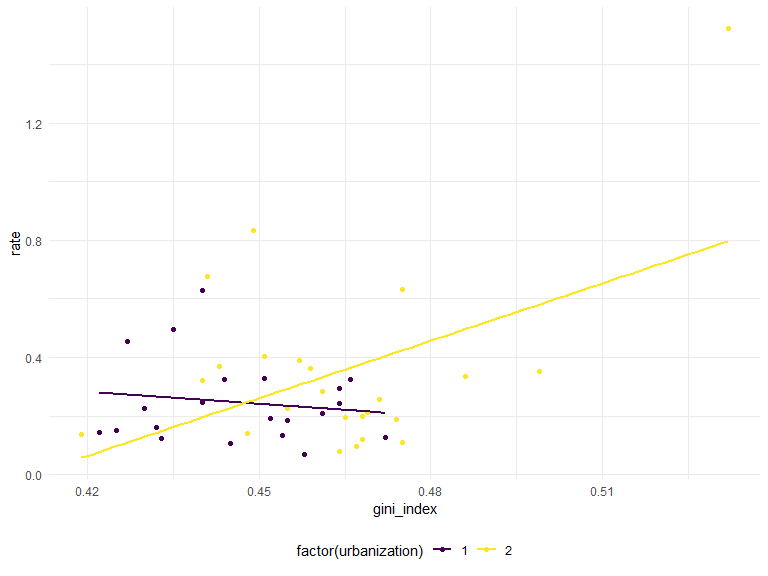
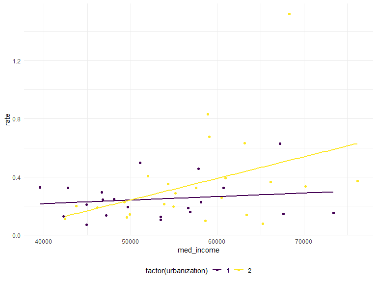
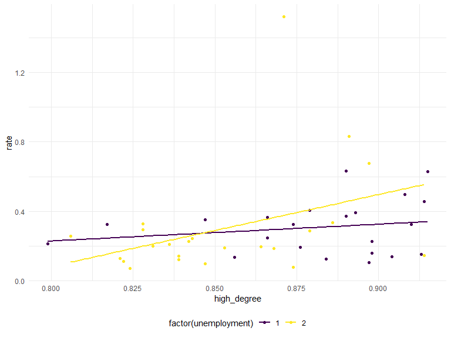

P8130 Final Project
================
Pengyuan Su (ps3195), Shuhong Xiang (sx2289), Yali Zhai (yz3959),
Zhixing Wu (zw2709)
12/6/2020

``` r
library(tidyverse)
library(modelr)
library(arsenal)
library(broom)
```

    ## 
    ## Attaching package: 'broom'

    ## The following object is masked from 'package:modelr':
    ## 
    ##     bootstrap

``` r
library(modelr)
library(patchwork)
library(mgcv)
```

    ## Loading required package: nlme

    ## 
    ## Attaching package: 'nlme'

    ## The following object is masked from 'package:dplyr':
    ## 
    ##     collapse

    ## This is mgcv 1.8-33. For overview type 'help("mgcv-package")'.

    ## 
    ## Attaching package: 'mgcv'

    ## The following object is masked from 'package:arsenal':
    ## 
    ##     negbin

``` r
library(faraway)
library(skimr)
```

# Abstract

# Introduction

Hate crime is a significant issue under the present circumstances. There
exist multiple variables related to hate crime. In this project, we
intend to find the relationships between the hate crime rate and the
eight variables. Among the eight variables, income status is about
unemployment level, medians of household income, and Gini index in the
dataset. Especially, the Gini index is a measure of the distribution of
income across a population developed by the Italian statistician Corrado
Gini in 1912. \[1\] In real life, the high-valued Gini index implies the
high levels of inequality in the whole society. Also, the high
unemployment rate will lower the medians of household income. People
without employment are more likely to participate in hate crime. \[2\]
Besides, the education level matters in income status. A higher level of
education status, like the high-school degree in this study, will lead
to an occupation with a higher salary, which can increase the medians of
household income and decrease unemployment.

Hate crime, according to website information
(<https://hatecrime.campaign.gov.uk/>), is regarded as the criminal
offence motivated by hostility or prejudice of others’ some
characteristics, including race, religion, sexual orientation,
transgender identity, disability. And our project mainly emphasizes on
the possible variables which might have close relation with the hate
crime rate.

The race consideration might become the most common cause of hate crime.
Based on the statistics provided
(<https://law.jrank.org/pages/12135/Race-Ethnicity-Hate-Crimes.html> ),
hate crimes resulting from race were about 49 percent in 2002 and 67
percent of victims attacked for racial problems were black Americans.

It is pointed out in this
article(<https://www.assignmentpoint.com/arts/social-science/the-role-of-urbanization-in-increasing-crime-in-urban-area-2.html>)
that the crime and urbanization seem to be correlated in terms of
sociological aspects since it have be linked between criminal cases and
the socio-economic development levels.

<https://safer-america.com/map-of-reported-hate-crimes-in-the-u-s-a/>
According to the Uniform Crime Reporting Program’s Hate Crime Statistics
Program, all the hate crimes reported to the FBI in 2017 of all the
states except Hawaii were shown, and the Pennsylvania had 1488 cases and
ranked the first. While in terms of the Hate Crimes per 100,000, the
District of Columbia had the largest figure of 27.81.

# Data Analysis

## Tidy:

`rate`: hate\_crimes\_per\_100k\_splc

`med_income`: median\_household\_income

`high_degree`: perc\_population\_with\_high\_school\_degree

`non_citizen`: perc\_non\_citizen

`non_white`: perc\_non\_white

``` r
hc_df = 
  read_csv(here::here("data/HateCrimes.csv")) %>% 
  janitor::clean_names() %>% 
  mutate(hate_crimes_per_100k_splc = as.numeric(hate_crimes_per_100k_splc)) %>% 
  drop_na() %>% 
  rename(., 
         rate = hate_crimes_per_100k_splc, 
         med_income = median_household_income, 
         high_degree = perc_population_with_high_school_degree, 
         non_citizen = perc_non_citizen, 
         non_white = perc_non_white)
```

    ## 
    ## -- Column specification --------------------------------------------------------
    ## cols(
    ##   state = col_character(),
    ##   unemployment = col_character(),
    ##   urbanization = col_character(),
    ##   median_household_income = col_double(),
    ##   perc_population_with_high_school_degree = col_double(),
    ##   perc_non_citizen = col_double(),
    ##   gini_index = col_double(),
    ##   perc_non_white = col_double(),
    ##   hate_crimes_per_100k_splc = col_character()
    ## )

``` r
head(hc_df)
```

    ## # A tibble: 6 x 9
    ##   state unemployment urbanization med_income high_degree non_citizen gini_index
    ##   <chr> <chr>        <chr>             <dbl>       <dbl>       <dbl>      <dbl>
    ## 1 Alab~ high         low               42278       0.821        0.02      0.472
    ## 2 Alas~ high         low               67629       0.914        0.04      0.422
    ## 3 Ariz~ high         high              49254       0.842        0.1       0.455
    ## 4 Arka~ high         low               44922       0.824        0.04      0.458
    ## 5 Cali~ high         high              60487       0.806        0.13      0.471
    ## 6 Colo~ low          high              60940       0.893        0.06      0.457
    ## # ... with 2 more variables: non_white <dbl>, rate <dbl>

Description by table?

``` r
my_controls <- tableby.control(
               total = T, # do you wanna show he overall col?
               test=F,  # No test p-values yet
               numeric.stats = c("meansd", "medianq1q3", "range", "Nmiss2"), # for the continuous var. (a.k.a numeric var.) 
               cat.stats = c("countpct", "Nmiss2"), # for categorical var., we select the count, percentage, and missing values.
               stats.labels = list(
               meansd = "Mean (SD)",
               medianq1q3 = "Median (Q1, Q3)",
               range = "Min - Max",
               Nmiss2 = "Missing",
               countpct = "N (%)"))


## or use skim()


#summary(tab1, title = "Descriptive statistics ", text = T,  digits = 1) %>%  knitr::kable()   
```

### change “unemployment” and “urbanization” from characters to corresponding numbers

use 1 and 2 to denote the level low and high

``` r
hc_df = 
  hc_df %>% 
  mutate(
    unemployment = case_when(
      unemployment == "low" ~ 1,
      unemployment == "high" ~ 2)
  ) %>% 
  mutate(
    urbanization = case_when(
      urbanization == "low" ~ 1,
      urbanization == "high" ~ 2)
  ) %>% 
  mutate(urbanization = as.factor(urbanization),
         unemployment = as.factor(unemployment)) %>% 
  select(-state)
```

## Plot distribution of hate crimes rate

``` r
hc_df %>% 
  ggplot(aes(x = rate, y = ..density..)) +
  geom_histogram(fill = "blue", alpha = .4) +
  geom_density(aes( x = rate, y = ..density..)) +
  theme_bw() +
  labs(title = "Distribution for hate crimes per 100k",
       x = "hate crimes per 100k splc",
       y = " Count") +
  theme(plot.title = element_text(hjust = .5 ))
```

    ## `stat_bin()` using `bins = 30`. Pick better value with `binwidth`.


``` r
hc_df_log = 
  hc_df %>% 
  mutate(lg = log(rate)) %>% 
  select(-rate)

hc_df_log%>% 
  ggplot(aes(x = lg, y = ..density..)) +
  geom_histogram(fill = "blue", alpha = .4) +
  geom_density(aes( lg, y = ..density..)) +
  theme_bw() +
  labs(title = "Distribution for Log ",
       x = "Log (hate crimes per 100k splc)",
       y = " Count") +
  theme(plot.title = element_text(hjust = .5 ))
```

    ## `stat_bin()` using `bins = 30`. Pick better value with `binwidth`.


``` r
# Histogram - notice the severe right skew
hist(hc_df_log$lg, xlab="log(hate crimes per 100k splc)", freq=T, col=2)
```


``` r
# Create a quantile-quantile plot (QQplot)
qqnorm(hc_df_log$lg, col=2, pch=19, cex=1.5)

# Add a straight line which passes through the first and third quartiles.
qqline(hc_df_log$lg, col = 1,lwd=2,lty=2)
```


Based on the QQ plot in terms of the log(hate crimes per 100k splc), the
points are nearly distributed along the straight line, so there is not
severe departure from the normality.

``` r
# Perform Shapiro-Wilk test
shapiro.test(hc_df_log$lg)
```

    ## 
    ##  Shapiro-Wilk normality test
    ## 
    ## data:  hc_df_log$lg
    ## W = 0.98308, p-value = 0.7453

H0: the log(hate crimes per 100k splc) is normally distributed H1: the
log(hate crimes per 100k splc) is not normally distributed

The W test statistic is 0.983 with p value of 0.7453.

Since the p value is greater than 0.05, so we fail to reject the null
and we could conclude that the log(hate crimes per 100k splc) seems to
be normally distributed under the significance level of 5%.

## Verify association

**income**

``` r
income = 
 lm(rate ~ med_income, data = hc_df)
summary(income)
```

    ## 
    ## Call:
    ## lm(formula = rate ~ med_income, data = hc_df)
    ## 
    ## Residuals:
    ##      Min       1Q   Median       3Q      Max 
    ## -0.32518 -0.12668 -0.04373  0.05772  1.09488 
    ## 
    ## Coefficients:
    ##               Estimate Std. Error t value Pr(>|t|)  
    ## (Intercept) -2.302e-01  2.247e-01  -1.024   0.3114  
    ## med_income   9.631e-06  4.012e-06   2.401   0.0208 *
    ## ---
    ## Signif. codes:  0 '***' 0.001 '**' 0.01 '*' 0.05 '.' 0.1 ' ' 1
    ## 
    ## Residual standard error: 0.239 on 43 degrees of freedom
    ## Multiple R-squared:  0.1182, Adjusted R-squared:  0.09768 
    ## F-statistic: 5.763 on 1 and 43 DF,  p-value: 0.02076

``` r
income_ = 
  lm(lg ~ med_income, data = hc_df_log)
summary(income_)
```

    ## 
    ## Call:
    ## lm(formula = lg ~ med_income, data = hc_df_log)
    ## 
    ## Residuals:
    ##      Min       1Q   Median       3Q      Max 
    ## -1.34892 -0.41049 -0.00482  0.39402  1.55022 
    ## 
    ## Coefficients:
    ##               Estimate Std. Error t value Pr(>|t|)    
    ## (Intercept) -2.665e+00  5.870e-01  -4.540 4.49e-05 ***
    ## med_income   2.248e-05  1.048e-05   2.145   0.0376 *  
    ## ---
    ## Signif. codes:  0 '***' 0.001 '**' 0.01 '*' 0.05 '.' 0.1 ' ' 1
    ## 
    ## Residual standard error: 0.6242 on 43 degrees of freedom
    ## Multiple R-squared:  0.09668,    Adjusted R-squared:  0.07567 
    ## F-statistic: 4.602 on 1 and 43 DF,  p-value: 0.03762

**high school degree**

``` r
degree = 
 lm(rate ~ high_degree, data = hc_df)

summary(degree)
```

    ## 
    ## Call:
    ## lm(formula = rate ~ high_degree, data = hc_df)
    ## 
    ## Residuals:
    ##      Min       1Q   Median       3Q      Max 
    ## -0.25882 -0.13075 -0.03059  0.07053  1.21096 
    ## 
    ## Coefficients:
    ##             Estimate Std. Error t value Pr(>|t|)  
    ## (Intercept)  -1.4520     0.9829  -1.477   0.1469  
    ## high_degree   2.0245     1.1334   1.786   0.0811 .
    ## ---
    ## Signif. codes:  0 '***' 0.001 '**' 0.01 '*' 0.05 '.' 0.1 ' ' 1
    ## 
    ## Residual standard error: 0.2455 on 43 degrees of freedom
    ## Multiple R-squared:  0.06907,    Adjusted R-squared:  0.04742 
    ## F-statistic: 3.191 on 1 and 43 DF,  p-value: 0.08112

``` r
degree_ = 
 lm(lg ~ high_degree, data = hc_df_log)

summary(degree_)
```

    ## 
    ## Call:
    ## lm(formula = lg ~ high_degree, data = hc_df_log)
    ## 
    ## Residuals:
    ##      Min       1Q   Median       3Q      Max 
    ## -1.16891 -0.52541  0.04074  0.41514  1.81610 
    ## 
    ## Coefficients:
    ##             Estimate Std. Error t value Pr(>|t|)  
    ## (Intercept)   -6.523      2.511  -2.597   0.0128 *
    ## high_degree    5.886      2.896   2.032   0.0483 *
    ## ---
    ## Signif. codes:  0 '***' 0.001 '**' 0.01 '*' 0.05 '.' 0.1 ' ' 1
    ## 
    ## Residual standard error: 0.6274 on 43 degrees of freedom
    ## Multiple R-squared:  0.08765,    Adjusted R-squared:  0.06643 
    ## F-statistic: 4.131 on 1 and 43 DF,  p-value: 0.04831

**non citizen**

``` r
noncitizen = 
 lm(rate ~ non_citizen, data = hc_df)

summary(noncitizen)
```

    ## 
    ## Call:
    ## lm(formula = rate ~ non_citizen, data = hc_df)
    ## 
    ## Residuals:
    ##      Min       1Q   Median       3Q      Max 
    ## -0.33134 -0.13873 -0.04796  0.07165  1.11265 
    ## 
    ## Coefficients:
    ##             Estimate Std. Error t value Pr(>|t|)  
    ## (Intercept)  0.19390    0.07549   2.568   0.0138 *
    ## non_citizen  1.96134    1.19134   1.646   0.1070  
    ## ---
    ## Signif. codes:  0 '***' 0.001 '**' 0.01 '*' 0.05 '.' 0.1 ' ' 1
    ## 
    ## Residual standard error: 0.2468 on 43 degrees of freedom
    ## Multiple R-squared:  0.0593, Adjusted R-squared:  0.03742 
    ## F-statistic:  2.71 on 1 and 43 DF,  p-value: 0.107

``` r
noncitizen_ = 
 lm(lg ~ non_citizen, data = hc_df_log)

summary(noncitizen_)
```

    ## 
    ## Call:
    ## lm(formula = lg ~ non_citizen, data = hc_df_log)
    ## 
    ## Residuals:
    ##      Min       1Q   Median       3Q      Max 
    ## -1.28098 -0.47432 -0.06726  0.39582  1.68638 
    ## 
    ## Coefficients:
    ##             Estimate Std. Error t value Pr(>|t|)    
    ## (Intercept)   -1.579      0.199  -7.936 5.84e-10 ***
    ## non_citizen    2.847      3.140   0.906     0.37    
    ## ---
    ## Signif. codes:  0 '***' 0.001 '**' 0.01 '*' 0.05 '.' 0.1 ' ' 1
    ## 
    ## Residual standard error: 0.6506 on 43 degrees of freedom
    ## Multiple R-squared:  0.01875,    Adjusted R-squared:  -0.004069 
    ## F-statistic: 0.8217 on 1 and 43 DF,  p-value: 0.3697

**non white**

``` r
nonwhite = 
 lm(rate ~ non_white, data = hc_df)

summary(nonwhite)
```

    ## 
    ## Call:
    ## lm(formula = rate ~ non_white, data = hc_df)
    ## 
    ## Residuals:
    ##      Min       1Q   Median       3Q      Max 
    ## -0.24715 -0.14189 -0.09149  0.05348  1.16111 
    ## 
    ## Coefficients:
    ##             Estimate Std. Error t value Pr(>|t|)   
    ## (Intercept)  0.24271    0.08973   2.705  0.00975 **
    ## non_white    0.18807    0.25640   0.734  0.46723   
    ## ---
    ## Signif. codes:  0 '***' 0.001 '**' 0.01 '*' 0.05 '.' 0.1 ' ' 1
    ## 
    ## Residual standard error: 0.2529 on 43 degrees of freedom
    ## Multiple R-squared:  0.01236,    Adjusted R-squared:  -0.01061 
    ## F-statistic: 0.538 on 1 and 43 DF,  p-value: 0.4672

``` r
nonwhite_ = 
 lm(lg ~ non_white, data = hc_df_log)

summary(nonwhite_)
```

    ## 
    ## Call:
    ## lm(formula = lg ~ non_white, data = hc_df_log)
    ## 
    ## Residuals:
    ##      Min       1Q   Median       3Q      Max 
    ## -1.25268 -0.51498 -0.06342  0.37672  1.85113 
    ## 
    ## Coefficients:
    ##             Estimate Std. Error t value Pr(>|t|)    
    ## (Intercept) -1.41249    0.23303  -6.062 2.98e-07 ***
    ## non_white   -0.02923    0.66590  -0.044    0.965    
    ## ---
    ## Signif. codes:  0 '***' 0.001 '**' 0.01 '*' 0.05 '.' 0.1 ' ' 1
    ## 
    ## Residual standard error: 0.6568 on 43 degrees of freedom
    ## Multiple R-squared:  4.482e-05,  Adjusted R-squared:  -0.02321 
    ## F-statistic: 0.001927 on 1 and 43 DF,  p-value: 0.9652

**gini index**

``` r
gini = 
 lm(rate ~ gini_index, data = hc_df)

summary(gini)
```

    ## 
    ## Call:
    ## lm(formula = rate ~ gini_index, data = hc_df)
    ## 
    ## Residuals:
    ##      Min       1Q   Median       3Q      Max 
    ## -0.28113 -0.14973 -0.04568  0.07525  0.87041 
    ## 
    ## Coefficients:
    ##             Estimate Std. Error t value Pr(>|t|)   
    ## (Intercept)  -1.7844     0.7742  -2.305  0.02608 * 
    ## gini_index    4.5794     1.6973   2.698  0.00992 **
    ## ---
    ## Signif. codes:  0 '***' 0.001 '**' 0.01 '*' 0.05 '.' 0.1 ' ' 1
    ## 
    ## Residual standard error: 0.2353 on 43 degrees of freedom
    ## Multiple R-squared:  0.1448, Adjusted R-squared:  0.1249 
    ## F-statistic:  7.28 on 1 and 43 DF,  p-value: 0.009924

``` r
gini_ = 
 lm(lg ~ gini_index, data = hc_df_log)

summary(gini_)
```

    ## 
    ## Call:
    ## lm(formula = lg ~ gini_index, data = hc_df_log)
    ## 
    ## Residuals:
    ##      Min       1Q   Median       3Q      Max 
    ## -1.26668 -0.32023 -0.04551  0.38663  1.32392 
    ## 
    ## Coefficients:
    ##             Estimate Std. Error t value Pr(>|t|)  
    ## (Intercept)   -4.515      2.109  -2.141    0.038 *
    ## gini_index     6.789      4.623   1.469    0.149  
    ## ---
    ## Signif. codes:  0 '***' 0.001 '**' 0.01 '*' 0.05 '.' 0.1 ' ' 1
    ## 
    ## Residual standard error: 0.6409 on 43 degrees of freedom
    ## Multiple R-squared:  0.04776,    Adjusted R-squared:  0.02562 
    ## F-statistic: 2.157 on 1 and 43 DF,  p-value: 0.1492

**unemployment**

``` r
unemployment = 
 lm(rate ~ unemployment, data = hc_df)

summary(unemployment)
```

    ## 
    ## Call:
    ## lm(formula = rate ~ unemployment, data = hc_df)
    ## 
    ## Residuals:
    ##      Min       1Q   Median       3Q      Max 
    ## -0.22934 -0.15510 -0.07308  0.04398  1.22390 
    ## 
    ## Coefficients:
    ##                Estimate Std. Error t value Pr(>|t|)    
    ## (Intercept)    0.306645   0.054246   5.653 1.17e-06 ***
    ## unemployment2 -0.008248   0.075877  -0.109    0.914    
    ## ---
    ## Signif. codes:  0 '***' 0.001 '**' 0.01 '*' 0.05 '.' 0.1 ' ' 1
    ## 
    ## Residual standard error: 0.2544 on 43 degrees of freedom
    ## Multiple R-squared:  0.0002747,  Adjusted R-squared:  -0.02297 
    ## F-statistic: 0.01182 on 1 and 43 DF,  p-value: 0.9139

``` r
unemployment_ = 
 lm(lg ~ unemployment, data = hc_df_log)

summary(unemployment_)
```

    ## 
    ## Call:
    ## lm(formula = lg ~ unemployment, data = hc_df_log)
    ## 
    ## Residuals:
    ##      Min       1Q   Median       3Q      Max 
    ## -1.14546 -0.52433 -0.03384  0.31838  1.94753 
    ## 
    ## Coefficients:
    ##               Estimate Std. Error t value Pr(>|t|)    
    ## (Intercept)    -1.3114     0.1380  -9.501 3.99e-12 ***
    ## unemployment2  -0.2159     0.1931  -1.118     0.27    
    ## ---
    ## Signif. codes:  0 '***' 0.001 '**' 0.01 '*' 0.05 '.' 0.1 ' ' 1
    ## 
    ## Residual standard error: 0.6475 on 43 degrees of freedom
    ## Multiple R-squared:  0.02825,    Adjusted R-squared:  0.005648 
    ## F-statistic:  1.25 on 1 and 43 DF,  p-value: 0.2698

**urbanization**

``` r
urbanization = 
 lm(rate ~ urbanization, data = hc_df)

summary(urbanization)
```

    ## 
    ## Call:
    ## lm(formula = rate ~ urbanization, data = hc_df)
    ## 
    ## Residuals:
    ##      Min       1Q   Median       3Q      Max 
    ## -0.27357 -0.13829 -0.05521  0.04889  1.17043 
    ## 
    ## Coefficients:
    ##               Estimate Std. Error t value Pr(>|t|)    
    ## (Intercept)    0.24593    0.05426   4.532 4.61e-05 ***
    ## urbanization2  0.10594    0.07430   1.426    0.161    
    ## ---
    ## Signif. codes:  0 '***' 0.001 '**' 0.01 '*' 0.05 '.' 0.1 ' ' 1
    ## 
    ## Residual standard error: 0.2487 on 43 degrees of freedom
    ## Multiple R-squared:  0.04515,    Adjusted R-squared:  0.02294 
    ## F-statistic: 2.033 on 1 and 43 DF,  p-value: 0.1611

``` r
urbanization_ = 
 lm(lg ~ urbanization, data = hc_df_log)

summary(urbanization_)
```

    ## 
    ## Call:
    ## lm(formula = lg ~ urbanization, data = hc_df_log)
    ## 
    ## Residuals:
    ##      Min       1Q   Median       3Q      Max 
    ## -1.23570 -0.39187 -0.01327  0.37117  1.73166 
    ## 
    ## Coefficients:
    ##               Estimate Std. Error t value Pr(>|t|)    
    ## (Intercept)    -1.5479     0.1409 -10.987  4.6e-14 ***
    ## urbanization2   0.2364     0.1929   1.226    0.227    
    ## ---
    ## Signif. codes:  0 '***' 0.001 '**' 0.01 '*' 0.05 '.' 0.1 ' ' 1
    ## 
    ## Residual standard error: 0.6456 on 43 degrees of freedom
    ## Multiple R-squared:  0.03375,    Adjusted R-squared:  0.01128 
    ## F-statistic: 1.502 on 1 and 43 DF,  p-value: 0.227

## MLR

``` r
mult.fit = lm(rate ~ ., data = hc_df)
step(mult.fit, direction='backward')
```

    ## Start:  AIC=-137.03
    ## rate ~ unemployment + urbanization + med_income + high_degree + 
    ##     non_citizen + gini_index + non_white
    ## 
    ##                Df Sum of Sq    RSS     AIC
    ## - non_white     1   0.00001 1.5008 -139.03
    ## - unemployment  1   0.00135 1.5021 -138.99
    ## - med_income    1   0.00258 1.5034 -138.95
    ## - urbanization  1   0.00618 1.5070 -138.85
    ## - non_citizen   1   0.01750 1.5183 -138.51
    ## <none>                      1.5008 -137.03
    ## - high_degree   1   0.34889 1.8497 -129.62
    ## - gini_index    1   0.77465 2.2754 -120.30
    ## 
    ## Step:  AIC=-139.03
    ## rate ~ unemployment + urbanization + med_income + high_degree + 
    ##     non_citizen + gini_index
    ## 
    ##                Df Sum of Sq    RSS     AIC
    ## - unemployment  1   0.00148 1.5023 -140.99
    ## - med_income    1   0.00269 1.5035 -140.95
    ## - urbanization  1   0.00617 1.5070 -140.85
    ## - non_citizen   1   0.02422 1.5250 -140.31
    ## <none>                      1.5008 -139.03
    ## - high_degree   1   0.38759 1.8884 -130.69
    ## - gini_index    1   0.77888 2.2797 -122.22
    ## 
    ## Step:  AIC=-140.99
    ## rate ~ urbanization + med_income + high_degree + non_citizen + 
    ##     gini_index
    ## 
    ##                Df Sum of Sq    RSS     AIC
    ## - med_income    1   0.00243 1.5047 -142.91
    ## - urbanization  1   0.00693 1.5092 -142.78
    ## - non_citizen   1   0.02401 1.5263 -142.27
    ## <none>                      1.5023 -140.99
    ## - high_degree   1   0.40517 1.9074 -132.24
    ## - gini_index    1   0.78876 2.2910 -124.00
    ## 
    ## Step:  AIC=-142.91
    ## rate ~ urbanization + high_degree + non_citizen + gini_index
    ## 
    ##                Df Sum of Sq    RSS     AIC
    ## - urbanization  1   0.00762 1.5123 -144.69
    ## - non_citizen   1   0.02232 1.5270 -144.25
    ## <none>                      1.5047 -142.91
    ## - gini_index    1   0.78737 2.2921 -125.97
    ## - high_degree   1   0.86254 2.3672 -124.52
    ## 
    ## Step:  AIC=-144.69
    ## rate ~ high_degree + non_citizen + gini_index
    ## 
    ##               Df Sum of Sq    RSS     AIC
    ## - non_citizen  1   0.01471 1.5270 -146.25
    ## <none>                     1.5123 -144.69
    ## - gini_index   1   0.78804 2.3004 -127.81
    ## - high_degree  1   0.85561 2.3679 -126.51
    ## 
    ## Step:  AIC=-146.25
    ## rate ~ high_degree + gini_index
    ## 
    ##               Df Sum of Sq    RSS     AIC
    ## <none>                     1.5270 -146.25
    ## - high_degree  1   0.85432 2.3813 -128.25
    ## - gini_index   1   1.06513 2.5922 -124.44

    ## 
    ## Call:
    ## lm(formula = rate ~ high_degree + gini_index, data = hc_df)
    ## 
    ## Coefficients:
    ## (Intercept)  high_degree   gini_index  
    ##      -8.103        5.059        8.825

rate \~ high\_degree + gini\_index

``` r
mult.fit = lm(lg ~ ., data = hc_df_log)
step(mult.fit, direction='backward')
```

    ## Start:  AIC=-40.88
    ## lg ~ unemployment + urbanization + med_income + high_degree + 
    ##     non_citizen + gini_index + non_white
    ## 
    ##                Df Sum of Sq    RSS     AIC
    ## - non_white     1   0.00456 12.719 -42.859
    ## - non_citizen   1   0.01570 12.730 -42.820
    ## - med_income    1   0.02556 12.740 -42.785
    ## - urbanization  1   0.05519 12.770 -42.680
    ## - unemployment  1   0.37413 13.089 -41.570
    ## <none>                      12.715 -40.875
    ## - high_degree   1   1.51318 14.228 -37.815
    ## - gini_index    1   2.90660 15.621 -33.611
    ## 
    ## Step:  AIC=-42.86
    ## lg ~ unemployment + urbanization + med_income + high_degree + 
    ##     non_citizen + gini_index
    ## 
    ##                Df Sum of Sq    RSS     AIC
    ## - non_citizen   1   0.01114 12.730 -44.820
    ## - med_income    1   0.02946 12.749 -44.755
    ## - urbanization  1   0.05718 12.777 -44.657
    ## - unemployment  1   0.41699 13.136 -43.408
    ## <none>                      12.719 -42.859
    ## - high_degree   1   1.73309 14.452 -39.111
    ## - gini_index    1   2.90620 15.626 -35.599
    ## 
    ## Step:  AIC=-44.82
    ## lg ~ unemployment + urbanization + med_income + high_degree + 
    ##     gini_index
    ## 
    ##                Df Sum of Sq    RSS     AIC
    ## - med_income    1   0.01910 12.750 -46.752
    ## - urbanization  1   0.11092 12.841 -46.429
    ## - unemployment  1   0.41466 13.145 -45.377
    ## <none>                      12.730 -44.820
    ## - high_degree   1   1.92883 14.659 -40.471
    ## - gini_index    1   3.00737 15.738 -37.277
    ## 
    ## Step:  AIC=-46.75
    ## lg ~ unemployment + urbanization + high_degree + gini_index
    ## 
    ##                Df Sum of Sq    RSS     AIC
    ## - urbanization  1   0.09183 12.841 -48.429
    ## - unemployment  1   0.40424 13.154 -47.348
    ## <none>                      12.750 -46.752
    ## - gini_index    1   3.02492 15.774 -39.172
    ## - high_degree   1   3.15688 15.906 -38.797
    ## 
    ## Step:  AIC=-48.43
    ## lg ~ unemployment + high_degree + gini_index
    ## 
    ##                Df Sum of Sq    RSS     AIC
    ## - unemployment  1    0.3655 13.207 -49.166
    ## <none>                      12.841 -48.429
    ## - high_degree   1    3.3459 16.187 -40.010
    ## - gini_index    1    4.0555 16.897 -38.079
    ## 
    ## Step:  AIC=-49.17
    ## lg ~ high_degree + gini_index
    ## 
    ##               Df Sum of Sq    RSS     AIC
    ## <none>                     13.207 -49.166
    ## - gini_index   1    3.7171 16.924 -40.007
    ## - high_degree  1    4.4569 17.664 -38.081

    ## 
    ## Call:
    ## lm(formula = lg ~ high_degree + gini_index, data = hc_df_log)
    ## 
    ## Coefficients:
    ## (Intercept)  high_degree   gini_index  
    ##      -18.95        11.55        16.49

lg \~ high\_degree + gini\_index

``` r
# ????
# three covariates
# rate ~ income + gini +unemployment
# log ~  income + degree
# aic ~ degree +gini

# focus on income + degree + gini and their interaction, maybe adjust for different levels of unemployment
```

## interaction

??

``` r
interaction = 
  lm(rate ~ med_income + high_degree + gini_index + med_income * high_degree + med_income * gini_index + high_degree * gini_index + med_income * high_degree * gini_index, data = hc_df)
summary(interaction)
```

    ## 
    ## Call:
    ## lm(formula = rate ~ med_income + high_degree + gini_index + med_income * 
    ##     high_degree + med_income * gini_index + high_degree * gini_index + 
    ##     med_income * high_degree * gini_index, data = hc_df)
    ## 
    ## Residuals:
    ##      Min       1Q   Median       3Q      Max 
    ## -0.42731 -0.08045 -0.01514  0.09041  0.51987 
    ## 
    ## Coefficients:
    ##                                     Estimate Std. Error t value Pr(>|t|)
    ## (Intercept)                        7.797e+01  1.656e+02   0.471    0.640
    ## med_income                        -2.238e-03  2.858e-03  -0.783    0.439
    ## high_degree                       -6.830e+01  1.910e+02  -0.358    0.723
    ## gini_index                        -1.530e+02  3.653e+02  -0.419    0.678
    ## med_income:high_degree             2.153e-03  3.280e-03   0.656    0.516
    ## med_income:gini_index              4.468e-03  6.298e-03   0.709    0.483
    ## high_degree:gini_index             1.297e+02  4.221e+02   0.307    0.760
    ## med_income:high_degree:gini_index -4.216e-03  7.240e-03  -0.582    0.564
    ## 
    ## Residual standard error: 0.1735 on 37 degrees of freedom
    ## Multiple R-squared:  0.6002, Adjusted R-squared:  0.5246 
    ## F-statistic: 7.935 on 7 and 37 DF,  p-value: 7.26e-06

``` r
interaction_ = 
  lm(lg ~ med_income + high_degree + gini_index + med_income * high_degree + med_income * gini_index + high_degree * gini_index + med_income * high_degree * gini_index, data = hc_df_log)
summary(interaction_)
```

    ## 
    ## Call:
    ## lm(formula = lg ~ med_income + high_degree + gini_index + med_income * 
    ##     high_degree + med_income * gini_index + high_degree * gini_index + 
    ##     med_income * high_degree * gini_index, data = hc_df_log)
    ## 
    ## Residuals:
    ##      Min       1Q   Median       3Q      Max 
    ## -1.31748 -0.43474  0.09948  0.42947  1.12477 
    ## 
    ## Coefficients:
    ##                                     Estimate Std. Error t value Pr(>|t|)
    ## (Intercept)                       -7.292e+01  5.482e+02  -0.133    0.895
    ## med_income                         1.934e-04  9.462e-03   0.020    0.984
    ## high_degree                        1.142e+02  6.324e+02   0.181    0.858
    ## gini_index                         1.749e+02  1.209e+03   0.145    0.886
    ## med_income:high_degree            -8.704e-04  1.086e-02  -0.080    0.937
    ## med_income:gini_index             -1.060e-03  2.085e-02  -0.051    0.960
    ## high_degree:gini_index            -2.718e+02  1.397e+03  -0.195    0.847
    ## med_income:high_degree:gini_index  2.648e-03  2.397e-02   0.110    0.913
    ## 
    ## Residual standard error: 0.5742 on 37 degrees of freedom
    ## Multiple R-squared:  0.3422, Adjusted R-squared:  0.2178 
    ## F-statistic:  2.75 on 7 and 37 DF,  p-value: 0.02099

## Correlation

## regression of all numeric variables

``` r
reg_all = lm(rate ~ med_income + high_degree + non_citizen + gini_index + non_white, data = hc_df)
 summary(reg_all)
```

    ## 
    ## Call:
    ## lm(formula = rate ~ med_income + high_degree + non_citizen + 
    ##     gini_index + non_white, data = hc_df)
    ## 
    ## Residuals:
    ##      Min       1Q   Median       3Q      Max 
    ## -0.36737 -0.10005 -0.01877  0.09497  0.52855 
    ## 
    ## Coefficients:
    ##               Estimate Std. Error t value Pr(>|t|)    
    ## (Intercept) -8.170e+00  1.841e+00  -4.437 7.25e-05 ***
    ## med_income  -1.589e-06  5.773e-06  -0.275  0.78461    
    ## high_degree  5.399e+00  1.788e+00   3.020  0.00444 ** 
    ## non_citizen  9.374e-01  1.643e+00   0.571  0.57154    
    ## gini_index   8.417e+00  1.873e+00   4.495 6.08e-05 ***
    ## non_white   -1.723e-02  3.485e-01  -0.049  0.96082    
    ## ---
    ## Signif. codes:  0 '***' 0.001 '**' 0.01 '*' 0.05 '.' 0.1 ' ' 1
    ## 
    ## Residual standard error: 0.1967 on 39 degrees of freedom
    ## Multiple R-squared:  0.458,  Adjusted R-squared:  0.3885 
    ## F-statistic: 6.592 on 5 and 39 DF,  p-value: 0.0001558

## stepwise

``` r
#hc_df$unemployment <-ifelse(hc_df$unemployment=="high",1,ifelse(hc_df$unemployment=="low", 0, NA))

#hc_df$urbanization <-ifelse(hc_df$urbanization=="high",1,ifelse(hc_df$urbanization=="low", 0, NA))

 #hc_df = 
 # hc_df %>% 
 # select(-state)  

model =  
  lm(rate ~ ., data = hc_df) 

 step(model, direction = 'backward')
```

    ## Start:  AIC=-137.03
    ## rate ~ unemployment + urbanization + med_income + high_degree + 
    ##     non_citizen + gini_index + non_white
    ## 
    ##                Df Sum of Sq    RSS     AIC
    ## - non_white     1   0.00001 1.5008 -139.03
    ## - unemployment  1   0.00135 1.5021 -138.99
    ## - med_income    1   0.00258 1.5034 -138.95
    ## - urbanization  1   0.00618 1.5070 -138.85
    ## - non_citizen   1   0.01750 1.5183 -138.51
    ## <none>                      1.5008 -137.03
    ## - high_degree   1   0.34889 1.8497 -129.62
    ## - gini_index    1   0.77465 2.2754 -120.30
    ## 
    ## Step:  AIC=-139.03
    ## rate ~ unemployment + urbanization + med_income + high_degree + 
    ##     non_citizen + gini_index
    ## 
    ##                Df Sum of Sq    RSS     AIC
    ## - unemployment  1   0.00148 1.5023 -140.99
    ## - med_income    1   0.00269 1.5035 -140.95
    ## - urbanization  1   0.00617 1.5070 -140.85
    ## - non_citizen   1   0.02422 1.5250 -140.31
    ## <none>                      1.5008 -139.03
    ## - high_degree   1   0.38759 1.8884 -130.69
    ## - gini_index    1   0.77888 2.2797 -122.22
    ## 
    ## Step:  AIC=-140.99
    ## rate ~ urbanization + med_income + high_degree + non_citizen + 
    ##     gini_index
    ## 
    ##                Df Sum of Sq    RSS     AIC
    ## - med_income    1   0.00243 1.5047 -142.91
    ## - urbanization  1   0.00693 1.5092 -142.78
    ## - non_citizen   1   0.02401 1.5263 -142.27
    ## <none>                      1.5023 -140.99
    ## - high_degree   1   0.40517 1.9074 -132.24
    ## - gini_index    1   0.78876 2.2910 -124.00
    ## 
    ## Step:  AIC=-142.91
    ## rate ~ urbanization + high_degree + non_citizen + gini_index
    ## 
    ##                Df Sum of Sq    RSS     AIC
    ## - urbanization  1   0.00762 1.5123 -144.69
    ## - non_citizen   1   0.02232 1.5270 -144.25
    ## <none>                      1.5047 -142.91
    ## - gini_index    1   0.78737 2.2921 -125.97
    ## - high_degree   1   0.86254 2.3672 -124.52
    ## 
    ## Step:  AIC=-144.69
    ## rate ~ high_degree + non_citizen + gini_index
    ## 
    ##               Df Sum of Sq    RSS     AIC
    ## - non_citizen  1   0.01471 1.5270 -146.25
    ## <none>                     1.5123 -144.69
    ## - gini_index   1   0.78804 2.3004 -127.81
    ## - high_degree  1   0.85561 2.3679 -126.51
    ## 
    ## Step:  AIC=-146.25
    ## rate ~ high_degree + gini_index
    ## 
    ##               Df Sum of Sq    RSS     AIC
    ## <none>                     1.5270 -146.25
    ## - high_degree  1   0.85432 2.3813 -128.25
    ## - gini_index   1   1.06513 2.5922 -124.44

    ## 
    ## Call:
    ## lm(formula = rate ~ high_degree + gini_index, data = hc_df)
    ## 
    ## Coefficients:
    ## (Intercept)  high_degree   gini_index  
    ##      -8.103        5.059        8.825

## Forward

``` r
# step1
fit1 <- lm(rate ~ unemployment, data = hc_df)
tidy(fit1)
```

    ## # A tibble: 2 x 5
    ##   term          estimate std.error statistic    p.value
    ##   <chr>            <dbl>     <dbl>     <dbl>      <dbl>
    ## 1 (Intercept)    0.307      0.0542     5.65  0.00000117
    ## 2 unemployment2 -0.00825    0.0759    -0.109 0.914

``` r
fit2 <- lm(rate ~ urbanization, data = hc_df)
tidy(fit2)
```

    ## # A tibble: 2 x 5
    ##   term          estimate std.error statistic   p.value
    ##   <chr>            <dbl>     <dbl>     <dbl>     <dbl>
    ## 1 (Intercept)      0.246    0.0543      4.53 0.0000461
    ## 2 urbanization2    0.106    0.0743      1.43 0.161

``` r
fit3 <- lm(rate ~ med_income, data = hc_df)
tidy(fit3)
```

    ## # A tibble: 2 x 5
    ##   term           estimate  std.error statistic p.value
    ##   <chr>             <dbl>      <dbl>     <dbl>   <dbl>
    ## 1 (Intercept) -0.230      0.225          -1.02  0.311 
    ## 2 med_income   0.00000963 0.00000401      2.40  0.0208

``` r
fit4 <- lm(rate ~ high_degree, data = hc_df)
tidy(fit4)
```

    ## # A tibble: 2 x 5
    ##   term        estimate std.error statistic p.value
    ##   <chr>          <dbl>     <dbl>     <dbl>   <dbl>
    ## 1 (Intercept)    -1.45     0.983     -1.48  0.147 
    ## 2 high_degree     2.02     1.13       1.79  0.0811

``` r
fit5 <- lm(rate ~ non_citizen, data = hc_df)
tidy(fit5)
```

    ## # A tibble: 2 x 5
    ##   term        estimate std.error statistic p.value
    ##   <chr>          <dbl>     <dbl>     <dbl>   <dbl>
    ## 1 (Intercept)    0.194    0.0755      2.57  0.0138
    ## 2 non_citizen    1.96     1.19        1.65  0.107

``` r
fit6 <- lm(rate ~ gini_index, data = hc_df)
tidy(fit6)
```

    ## # A tibble: 2 x 5
    ##   term        estimate std.error statistic p.value
    ##   <chr>          <dbl>     <dbl>     <dbl>   <dbl>
    ## 1 (Intercept)    -1.78     0.774     -2.30 0.0261 
    ## 2 gini_index      4.58     1.70       2.70 0.00992

``` r
fit7 <- lm(rate ~ non_white, data = hc_df)
tidy(fit7)
```

    ## # A tibble: 2 x 5
    ##   term        estimate std.error statistic p.value
    ##   <chr>          <dbl>     <dbl>     <dbl>   <dbl>
    ## 1 (Intercept)    0.243    0.0897     2.70  0.00975
    ## 2 non_white      0.188    0.256      0.734 0.467

``` r
forward1 = lm(rate ~ gini_index, data = hc_df)

# step 2
fit1 <- update(forward1, . ~ . +unemployment)
tidy(fit1)
```

    ## # A tibble: 3 x 5
    ##   term          estimate std.error statistic p.value
    ##   <chr>            <dbl>     <dbl>     <dbl>   <dbl>
    ## 1 (Intercept)     -2.20     0.825      -2.66 0.0110 
    ## 2 gini_index       5.60     1.84        3.04 0.00408
    ## 3 unemployment2   -0.103    0.0762     -1.35 0.184

``` r
fit2 <- update(forward1, . ~ . +urbanization)
tidy(fit2)
```

    ## # A tibble: 3 x 5
    ##   term          estimate std.error statistic p.value
    ##   <chr>            <dbl>     <dbl>     <dbl>   <dbl>
    ## 1 (Intercept)    -1.66      0.849     -1.95   0.0573
    ## 2 gini_index      4.27      1.90       2.25   0.0299
    ## 3 urbanization2   0.0299    0.0787     0.380  0.706

``` r
fit3 <- update(forward1, . ~ . +med_income)
tidy(fit3)
```

    ## # A tibble: 3 x 5
    ##   term          estimate  std.error statistic p.value
    ##   <chr>            <dbl>      <dbl>     <dbl>   <dbl>
    ## 1 (Intercept) -2.69      0.766          -3.51 0.00109
    ## 2 gini_index   5.20      1.56            3.32 0.00184
    ## 3 med_income   0.0000112 0.00000364      3.07 0.00369

``` r
fit4 <- update(forward1, . ~ . +high_degree)
tidy(fit4)
```

    ## # A tibble: 3 x 5
    ##   term        estimate std.error statistic    p.value
    ##   <chr>          <dbl>     <dbl>     <dbl>      <dbl>
    ## 1 (Intercept)    -8.10      1.45     -5.60 0.00000148
    ## 2 gini_index      8.82      1.63      5.41 0.00000276
    ## 3 high_degree     5.06      1.04      4.85 0.0000174

``` r
fit5 <- update(forward1, . ~ . +non_citizen)
tidy(fit5)
```

    ## # A tibble: 3 x 5
    ##   term        estimate std.error statistic p.value
    ##   <chr>          <dbl>     <dbl>     <dbl>   <dbl>
    ## 1 (Intercept)   -1.61      0.858    -1.88   0.0673
    ## 2 gini_index     4.12      1.95      2.11   0.0407
    ## 3 non_citizen    0.637     1.31      0.488  0.628

``` r
fit6 <- update(forward1, . ~ . +non_white)
tidy(fit6)
```

    ## # A tibble: 3 x 5
    ##   term        estimate std.error statistic p.value
    ##   <chr>          <dbl>     <dbl>     <dbl>   <dbl>
    ## 1 (Intercept)   -2.13      0.883    -2.41  0.0203 
    ## 2 gini_index     5.50      2.04      2.70  0.00997
    ## 3 non_white     -0.236     0.286    -0.824 0.415

``` r
forward2 = update(forward1, . ~ . +high_degree)

#step 3
fit1 <- update(forward2, . ~ . +unemployment)
tidy(fit1)
```

    ## # A tibble: 4 x 5
    ##   term          estimate std.error statistic    p.value
    ##   <chr>            <dbl>     <dbl>     <dbl>      <dbl>
    ## 1 (Intercept)    -8.07      1.47      -5.49  0.00000232
    ## 2 gini_index      8.90      1.69       5.26  0.00000483
    ## 3 high_degree     4.99      1.11       4.51  0.0000536 
    ## 4 unemployment2  -0.0126    0.0661    -0.191 0.849

``` r
fit2 <- update(forward2, . ~ . +urbanization)
tidy(fit2)
```

    ## # A tibble: 4 x 5
    ##   term          estimate std.error statistic    p.value
    ##   <chr>            <dbl>     <dbl>     <dbl>      <dbl>
    ## 1 (Intercept)   -8.10       1.52     -5.34   0.00000374
    ## 2 gini_index     8.81       1.81      4.86   0.0000175 
    ## 3 high_degree    5.06       1.06      4.77   0.0000237 
    ## 4 urbanization2  0.00111    0.0642    0.0174 0.986

``` r
fit3 <- update(forward2, . ~ . +med_income)
tidy(fit3)
```

    ## # A tibble: 4 x 5
    ##   term            estimate  std.error statistic   p.value
    ##   <chr>              <dbl>      <dbl>     <dbl>     <dbl>
    ## 1 (Intercept) -7.98        1.72          -4.63  0.0000365
    ## 2 gini_index   8.74        1.76           4.98  0.0000121
    ## 3 high_degree  4.92        1.47           3.35  0.00175  
    ## 4 med_income   0.000000616 0.00000455     0.135 0.893

``` r
fit4 <- update(forward2, . ~ . +non_citizen)
tidy(fit4)
```

    ## # A tibble: 4 x 5
    ##   term        estimate std.error statistic    p.value
    ##   <chr>          <dbl>     <dbl>     <dbl>      <dbl>
    ## 1 (Intercept)   -7.93       1.48    -5.34  0.00000370
    ## 2 gini_index     8.35       1.81     4.62  0.0000375 
    ## 3 high_degree    5.06       1.05     4.82  0.0000202 
    ## 4 non_citizen    0.667      1.06     0.631 0.531

``` r
fit5 <- update(forward2, . ~ . +non_white)
tidy(fit5)
```

    ## # A tibble: 4 x 5
    ##   term        estimate std.error statistic    p.value
    ##   <chr>          <dbl>     <dbl>     <dbl>      <dbl>
    ## 1 (Intercept)  -8.12       1.46     -5.55  0.00000188
    ## 2 gini_index    8.57       1.79      4.80  0.0000213 
    ## 3 high_degree   5.18       1.10      4.71  0.0000288 
    ## 4 non_white     0.0914     0.244     0.375 0.710

model based on income

``` r
income_reg = lm(rate ~ med_income, data = hc_df)
# step 1
fit1 <- update(income_reg, . ~ . +unemployment)
tidy(fit1)
```

    ## # A tibble: 3 x 5
    ##   term            estimate  std.error statistic p.value
    ##   <chr>              <dbl>      <dbl>     <dbl>   <dbl>
    ## 1 (Intercept)   -0.279     0.246         -1.13   0.264 
    ## 2 med_income     0.0000102 0.00000418     2.43   0.0194
    ## 3 unemployment2  0.0376    0.0743         0.506  0.616

``` r
fit2 <- update(income_reg, . ~ . +urbanization)
tidy(fit2)
```

    ## # A tibble: 3 x 5
    ##   term             estimate  std.error statistic p.value
    ##   <chr>               <dbl>      <dbl>     <dbl>   <dbl>
    ## 1 (Intercept)   -0.212      0.226         -0.937  0.354 
    ## 2 med_income     0.00000867 0.00000417     2.08   0.0437
    ## 3 urbanization2  0.0656     0.0742         0.885  0.381

``` r
fit3 <- update(income_reg, . ~ . +gini_index)
tidy(fit3)
```

    ## # A tibble: 3 x 5
    ##   term          estimate  std.error statistic p.value
    ##   <chr>            <dbl>      <dbl>     <dbl>   <dbl>
    ## 1 (Intercept) -2.69      0.766          -3.51 0.00109
    ## 2 med_income   0.0000112 0.00000364      3.07 0.00369
    ## 3 gini_index   5.20      1.56            3.32 0.00184

``` r
fit4 <- update(income_reg, . ~ . +high_degree)
tidy(fit4)
```

    ## # A tibble: 3 x 5
    ##   term           estimate  std.error statistic p.value
    ##   <chr>             <dbl>      <dbl>     <dbl>   <dbl>
    ## 1 (Intercept) -0.614      1.10          -0.556   0.581
    ## 2 med_income   0.00000840 0.00000534     1.57    0.123
    ## 3 high_degree  0.521      1.47           0.355   0.724

``` r
fit5 <- update(income_reg, . ~ . +non_citizen)
tidy(fit5)
```

    ## # A tibble: 3 x 5
    ##   term           estimate  std.error statistic p.value
    ##   <chr>             <dbl>      <dbl>     <dbl>   <dbl>
    ## 1 (Intercept) -0.227      0.225          -1.01  0.318 
    ## 2 med_income   0.00000833 0.00000421      1.98  0.0542
    ## 3 non_citizen  1.24       1.21            1.02  0.312

``` r
fit6 <- update(income_reg, . ~ . +non_white)
tidy(fit6) 
```

    ## # A tibble: 3 x 5
    ##   term           estimate  std.error statistic p.value
    ##   <chr>             <dbl>      <dbl>     <dbl>   <dbl>
    ## 1 (Intercept) -0.277      0.236         -1.17   0.248 
    ## 2 med_income   0.00000952 0.00000404     2.36   0.0231
    ## 3 non_white    0.166      0.244          0.679  0.501

``` r
forward1 = update(income_reg, . ~ . +gini_index)

#step 2
fit1 <- update(forward1, . ~ . +unemployment)
tidy(fit1)
```

    ## # A tibble: 4 x 5
    ##   term            estimate  std.error statistic  p.value
    ##   <chr>              <dbl>      <dbl>     <dbl>    <dbl>
    ## 1 (Intercept)   -2.86      0.801         -3.58  0.000911
    ## 2 med_income     0.0000105 0.00000375     2.81  0.00760 
    ## 3 gini_index     5.74      1.71           3.36  0.00170 
    ## 4 unemployment2 -0.0578    0.0724        -0.798 0.430

``` r
fit2 <- update(forward1, . ~ . +urbanization)
tidy(fit2)
```

    ## # A tibble: 4 x 5
    ##   term            estimate  std.error statistic p.value
    ##   <chr>              <dbl>      <dbl>     <dbl>   <dbl>
    ## 1 (Intercept)   -3.00      0.884         -3.39  0.00157
    ## 2 med_income     0.0000122 0.00000392     3.11  0.00340
    ## 3 gini_index     5.82      1.80           3.24  0.00240
    ## 4 urbanization2 -0.0544    0.0766        -0.711 0.481

``` r
fit3 <- update(forward1, . ~ . +high_degree)
tidy(fit3)
```

    ## # A tibble: 4 x 5
    ##   term            estimate  std.error statistic   p.value
    ##   <chr>              <dbl>      <dbl>     <dbl>     <dbl>
    ## 1 (Intercept) -7.98        1.72          -4.63  0.0000365
    ## 2 med_income   0.000000616 0.00000455     0.135 0.893    
    ## 3 gini_index   8.74        1.76           4.98  0.0000121
    ## 4 high_degree  4.92        1.47           3.35  0.00175

``` r
fit4 <- update(forward1, . ~ . +non_citizen)
tidy(fit4)
```

    ## # A tibble: 4 x 5
    ##   term          estimate  std.error statistic p.value
    ##   <chr>            <dbl>      <dbl>     <dbl>   <dbl>
    ## 1 (Intercept) -3.09      0.913         -3.39  0.00157
    ## 2 med_income   0.0000126 0.00000403     3.12  0.00326
    ## 3 gini_index   6.05      1.88           3.22  0.00252
    ## 4 non_citizen -1.07      1.31          -0.820 0.417

``` r
fit5 <- update(forward1, . ~ . +non_white)
tidy(fit5)
```

    ## # A tibble: 4 x 5
    ##   term          estimate  std.error statistic  p.value
    ##   <chr>            <dbl>      <dbl>     <dbl>    <dbl>
    ## 1 (Intercept) -3.25      0.868          -3.74 0.000556
    ## 2 med_income   0.0000118 0.00000364      3.25 0.00229 
    ## 3 gini_index   6.60      1.87            3.53 0.00104 
    ## 4 non_white   -0.349     0.261          -1.34 0.189

``` r
forward2 = update(forward1, . ~ . +high_degree)

#step 3
fit1 <- update(forward2, . ~ . +unemployment)
tidy(fit1)
```

    ## # A tibble: 5 x 5
    ##   term              estimate  std.error statistic   p.value
    ##   <chr>                <dbl>      <dbl>     <dbl>     <dbl>
    ## 1 (Intercept)   -7.95        1.75          -4.55  0.0000497
    ## 2 med_income     0.000000601 0.00000460     0.131 0.897    
    ## 3 gini_index     8.82        1.82           4.84  0.0000195
    ## 4 high_degree    4.86        1.52           3.19  0.00273  
    ## 5 unemployment2 -0.0125      0.0670        -0.187 0.853

``` r
fit2 <- update(forward2, . ~ . +urbanization)
tidy(fit2)
```

    ## # A tibble: 5 x 5
    ##   term              estimate  std.error statistic   p.value
    ##   <chr>                <dbl>      <dbl>     <dbl>     <dbl>
    ## 1 (Intercept)   -7.98        1.74         -4.57   0.0000456
    ## 2 med_income     0.000000698 0.00000503    0.139  0.890    
    ## 3 gini_index     8.77        1.86          4.70   0.0000306
    ## 4 high_degree    4.91        1.53          3.21   0.00260  
    ## 5 urbanization2 -0.00286     0.0710       -0.0403 0.968

``` r
fit3 <- update(forward2, . ~ . +non_white)
tidy(fit3)
```

    ## # A tibble: 5 x 5
    ##   term            estimate  std.error statistic   p.value
    ##   <chr>              <dbl>      <dbl>     <dbl>     <dbl>
    ## 1 (Intercept) -8.17        1.83         -4.48   0.0000620
    ## 2 med_income  -0.000000264 0.00000524   -0.0503 0.960    
    ## 3 gini_index   8.58        1.83          4.68   0.0000328
    ## 4 high_degree  5.24        1.75          2.99   0.00471  
    ## 5 non_white    0.0982      0.281         0.349  0.729

``` r
fit4 <- update(forward2, . ~ . +non_citizen)
tidy(fit4)
```

    ## # A tibble: 5 x 5
    ##   term           estimate  std.error statistic   p.value
    ##   <chr>             <dbl>      <dbl>     <dbl>     <dbl>
    ## 1 (Intercept) -8.19       1.76          -4.65  0.0000363
    ## 2 med_income  -0.00000162 0.00000566    -0.287 0.775    
    ## 3 gini_index   8.41       1.84           4.57  0.0000455
    ## 4 high_degree  5.43       1.66           3.27  0.00222  
    ## 5 non_citizen  0.890      1.32           0.674 0.504

outcome: rate \~ med\_income + high\_degree + gini\_index

# InteractIon check

urbanization & high\_degree

``` r
##Urbanization -- high_degree
hc_df %>% 
  ggplot(aes(x = high_degree, y = rate, color = factor(urbanization))) +
  geom_point() +
  stat_smooth(method = "lm", se = F)
```

    ## `geom_smooth()` using formula 'y ~ x'


urbanization & gini\_index

``` r
##Urbanization -- gini
hc_df %>% 
  ggplot(aes(x = gini_index, y = rate, color = factor(urbanization))) +
  geom_point() +
  stat_smooth(method = "lm", se = F)
```

    ## `geom_smooth()` using formula 'y ~ x'



urbanization & income

``` r
hc_df %>% 
  ggplot(aes(x = med_income, y = rate, color = factor(urbanization))) +
  geom_point() +
  stat_smooth(method = "lm", se = F)
```

    ## `geom_smooth()` using formula 'y ~ x'



unemployment & high\_degree

``` r
##Unemployment -- high_degree
hc_df %>% 
  ggplot(aes(x = high_degree, y = rate, color = factor(unemployment))) +
  geom_point() +
  stat_smooth(method = "lm", se = F)
```

    ## `geom_smooth()` using formula 'y ~ x'



unemployment & gini

``` r
##Unemployment -- gini
hc_df %>% 
  ggplot(aes(x = gini_index, y = rate, color = factor(unemployment))) +
  geom_point() +
  stat_smooth(method = "lm", se = F)
```

    ## `geom_smooth()` using formula 'y ~ x'


unemployment & income

``` r
hc_df %>% 
  ggplot(aes(x = med_income, y = rate, color = factor(unemployment))) +
  geom_point() +
  stat_smooth(method = "lm", se = F)
```

    ## `geom_smooth()` using formula 'y ~ x'


We check the interaction for `urbanization` and `unemployment` among
`income`, `high_degree`, and `gini_index` and find that the three
variables all have interactions with urbanizaiotn and unemployment. Next
step, we will check whether the interaction term is significant.

# add interaction to model and check significance

initial:

``` r
aic = 
  hc_df %>% 
  lm(rate ~ high_degree + gini_index, data = .)

summary(aic)
```

    ## 
    ## Call:
    ## lm(formula = rate ~ high_degree + gini_index, data = .)
    ## 
    ## Residuals:
    ##      Min       1Q   Median       3Q      Max 
    ## -0.33490 -0.11891 -0.03105  0.11430  0.52418 
    ## 
    ## Coefficients:
    ##             Estimate Std. Error t value Pr(>|t|)    
    ## (Intercept)   -8.103      1.447  -5.601 1.48e-06 ***
    ## high_degree    5.059      1.044   4.847 1.74e-05 ***
    ## gini_index     8.825      1.630   5.413 2.76e-06 ***
    ## ---
    ## Signif. codes:  0 '***' 0.001 '**' 0.01 '*' 0.05 '.' 0.1 ' ' 1
    ## 
    ## Residual standard error: 0.1907 on 42 degrees of freedom
    ## Multiple R-squared:  0.4516, Adjusted R-squared:  0.4255 
    ## F-statistic: 17.29 on 2 and 42 DF,  p-value: 3.32e-06

``` r
income_main = 
  hc_df %>% 
  lm(rate ~ med_income + gini_index, data = . )
summary(income_main)
```

    ## 
    ## Call:
    ## lm(formula = rate ~ med_income + gini_index, data = .)
    ## 
    ## Residuals:
    ##      Min       1Q   Median       3Q      Max 
    ## -0.37873 -0.12917 -0.03933  0.07706  0.67751 
    ## 
    ## Coefficients:
    ##               Estimate Std. Error t value Pr(>|t|)   
    ## (Intercept) -2.688e+00  7.663e-01  -3.507  0.00109 **
    ## med_income   1.120e-05  3.642e-06   3.075  0.00369 **
    ## gini_index   5.203e+00  1.565e+00   3.325  0.00184 **
    ## ---
    ## Signif. codes:  0 '***' 0.001 '**' 0.01 '*' 0.05 '.' 0.1 ' ' 1
    ## 
    ## Residual standard error: 0.2151 on 42 degrees of freedom
    ## Multiple R-squared:  0.3019, Adjusted R-squared:  0.2687 
    ## F-statistic: 9.083 on 2 and 42 DF,  p-value: 0.0005272

add interaction:

1.  check for adding all interactions for the two models

<!-- end list -->

``` r
inter_model_aic = 
  hc_df %>% 
  lm(rate ~ high_degree + gini_index + high_degree * urbanization + high_degree * unemployment + gini_index * urbanization + gini_index * unemployment, data = .)

summary(inter_model_aic)
```

    ## 
    ## Call:
    ## lm(formula = rate ~ high_degree + gini_index + high_degree * 
    ##     urbanization + high_degree * unemployment + gini_index * 
    ##     urbanization + gini_index * unemployment, data = .)
    ## 
    ## Residuals:
    ##      Min       1Q   Median       3Q      Max 
    ## -0.39175 -0.12426  0.00115  0.09600  0.45099 
    ## 
    ## Coefficients:
    ##                           Estimate Std. Error t value Pr(>|t|)
    ## (Intercept)                 -2.344      5.094  -0.460    0.648
    ## high_degree                  1.596      2.812   0.568    0.574
    ## gini_index                   2.736      6.472   0.423    0.675
    ## urbanization2               -4.271      5.384  -0.793    0.433
    ## unemployment2               -3.286      3.423  -0.960    0.343
    ## high_degree:urbanization2    3.103      3.092   1.003    0.322
    ## high_degree:unemployment2    1.704      2.530   0.673    0.505
    ## gini_index:urbanization2     3.541      6.735   0.526    0.602
    ## gini_index:unemployment2     3.921      3.854   1.017    0.316
    ## 
    ## Residual standard error: 0.1989 on 36 degrees of freedom
    ## Multiple R-squared:  0.4885, Adjusted R-squared:  0.3748 
    ## F-statistic: 4.298 on 8 and 36 DF,  p-value: 0.001054

``` r
inter_model_baseon_income = 
  hc_df %>% 
  lm(rate ~ med_income + gini_index + gini_index * urbanization + gini_index * unemployment + med_income * urbanization + med_income * unemployment, data = .)

summary(inter_model_baseon_income)
```

    ## 
    ## Call:
    ## lm(formula = rate ~ med_income + gini_index + gini_index * urbanization + 
    ##     gini_index * unemployment + med_income * urbanization + med_income * 
    ##     unemployment, data = .)
    ## 
    ## Residuals:
    ##      Min       1Q   Median       3Q      Max 
    ## -0.37547 -0.12184 -0.04494  0.07549  0.58341 
    ## 
    ## Coefficients:
    ##                            Estimate Std. Error t value Pr(>|t|)
    ## (Intercept)               5.282e-01  2.803e+00   0.188    0.852
    ## med_income                1.020e-06  8.886e-06   0.115    0.909
    ## gini_index               -7.057e-01  5.588e+00  -0.126    0.900
    ## urbanization2            -2.742e+00  3.176e+00  -0.863    0.394
    ## unemployment2            -1.823e+00  1.875e+00  -0.972    0.338
    ## gini_index:urbanization2  4.870e+00  6.159e+00   0.791    0.434
    ## gini_index:unemployment2  3.560e+00  3.787e+00   0.940    0.353
    ## med_income:urbanization2  9.917e-06  1.077e-05   0.921    0.363
    ## med_income:unemployment2  2.957e-06  8.550e-06   0.346    0.731
    ## 
    ## Residual standard error: 0.2216 on 36 degrees of freedom
    ## Multiple R-squared:  0.3652, Adjusted R-squared:  0.2241 
    ## F-statistic: 2.588 on 8 and 36 DF,  p-value: 0.02409

2.  check adding interaction for a main predictor

<!-- end list -->

``` r
inter_model_gini = 
  hc_df %>% 
  lm(rate ~ gini_index + gini_index * unemployment + gini_index * urbanization, data = .)

summary(inter_model_gini)
```

    ## 
    ## Call:
    ## lm(formula = rate ~ gini_index + gini_index * unemployment + 
    ##     gini_index * urbanization, data = .)
    ## 
    ## Residuals:
    ##      Min       1Q   Median       3Q      Max 
    ## -0.31214 -0.14325 -0.04018  0.08455  0.64211 
    ## 
    ## Coefficients:
    ##                          Estimate Std. Error t value Pr(>|t|)
    ## (Intercept)                 1.093      1.718   0.636    0.528
    ## gini_index                 -1.831      3.871  -0.473    0.639
    ## unemployment2              -2.412      1.707  -1.412    0.166
    ## urbanization2              -2.482      1.920  -1.293    0.204
    ## gini_index:unemployment2    5.116      3.740   1.368    0.179
    ## gini_index:urbanization2    5.605      4.244   1.321    0.194
    ## 
    ## Residual standard error: 0.2276 on 39 degrees of freedom
    ## Multiple R-squared:  0.2743, Adjusted R-squared:  0.1813 
    ## F-statistic: 2.949 on 5 and 39 DF,  p-value: 0.02369

``` r
inter_model_highdegree = 
  hc_df %>% 
  lm(rate ~ high_degree + high_degree * unemployment + high_degree * urbanization, data = .)

summary(inter_model_highdegree)
```

    ## 
    ## Call:
    ## lm(formula = rate ~ high_degree + high_degree * unemployment + 
    ##     high_degree * urbanization, data = .)
    ## 
    ## Residuals:
    ##      Min       1Q   Median       3Q      Max 
    ## -0.34832 -0.11923 -0.04230  0.05871  1.11058 
    ## 
    ## Coefficients:
    ##                           Estimate Std. Error t value Pr(>|t|)
    ## (Intercept)                -0.1788     1.7429  -0.103    0.919
    ## high_degree                 0.4925     1.9730   0.250    0.804
    ## unemployment2              -1.6308     2.2523  -0.724    0.473
    ## urbanization2              -2.1066     2.0156  -1.045    0.302
    ## high_degree:unemployment2   1.9147     2.6050   0.735    0.467
    ## high_degree:urbanization2   2.5618     2.3307   1.099    0.278
    ## 
    ## Residual standard error: 0.2416 on 39 degrees of freedom
    ## Multiple R-squared:  0.1823, Adjusted R-squared:  0.07747 
    ## F-statistic: 1.739 on 5 and 39 DF,  p-value: 0.1486

``` r
inter_model_income = 
  hc_df %>% 
  lm(rate ~ med_income + med_income * unemployment + med_income * urbanization, data = .)

summary(inter_model_income)
```

    ## 
    ## Call:
    ## lm(formula = rate ~ med_income + med_income * unemployment + 
    ##     med_income * urbanization, data = .)
    ## 
    ## Residuals:
    ##      Min       1Q   Median       3Q      Max 
    ## -0.43900 -0.12937 -0.02858  0.07323  0.94928 
    ## 
    ## Coefficients:
    ##                            Estimate Std. Error t value Pr(>|t|)
    ## (Intercept)               3.402e-01  4.120e-01   0.826    0.414
    ## med_income               -1.471e-06  7.357e-06  -0.200    0.843
    ## unemployment2            -4.603e-01  4.750e-01  -0.969    0.339
    ## urbanization2            -5.606e-01  4.685e-01  -1.197    0.239
    ## med_income:unemployment2  8.562e-06  8.425e-06   1.016    0.316
    ## med_income:urbanization2  1.127e-05  8.382e-06   1.345    0.186
    ## 
    ## Residual standard error: 0.2386 on 39 degrees of freedom
    ## Multiple R-squared:  0.2025, Adjusted R-squared:  0.1003 
    ## F-statistic: 1.981 on 5 and 39 DF,  p-value: 0.1031

Conclude: we find that the interaction terms are not significant, and we
will not add them into the models.

Model 1: rate \~ high\_degree + gini\_index

Model 2: rate \~ income + gini\_index
